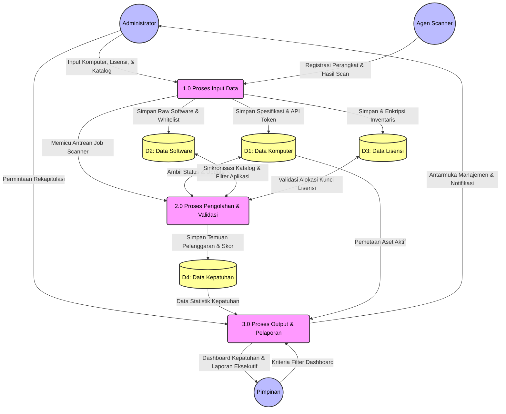

# Data Flow Diagram (DFD) Level 1 - Sistem Informasi Manifest Lisensi Perangkat Lunak untuk Mencegah Pelanggaran Hak Cipta di Lingkungan USN Kolaka

Berikut adalah rancangan Data Flow Diagram (DFD) Level 1 yang telah disederhanakan menjadi **3 Proses Utama (Input, Pengolahan, dan Output)**. Penyederhanaan ini sangat ideal untuk penulisan skripsi karena membedakan secara tegas fase masuknya data, evaluasi sistem, dan pelaporan hasil.

## Diagram DFD Level 1 (Sederhana 3 Proses)

## Penjelasan Proses DFD Level 1

Pada DFD Level 1 ini, sistem dipecah menjadi tiga fase logis utama yang menggambarkan siklus hidup data mulai dari masuk, dievaluasi, hingga menjadi informasi yang bermanfaat.

### 1.0 Proses Input Data (Pengumpulan & Pencatatan)
*   **Deskripsi:** Proses ini menangani seluruh pintu masuk data ke dalam sistem, baik secara otomatis melalui mesin (Agen) maupun manual oleh manusia (Admin).
*   **Aktivitas Utama:**
    *   Menerima registrasi awal komputer klien (memberikan token akses *Sanctum*).
    *   Menerima *payload* hasil *scan* yang berisi spesifikasi *hardware* (RAM, Penyimpanan) dan daftar *software* yang terinstal dari Agen (`ScanController`).
    *   Menerima masukan dari Administrator terkait penambahan aset secara manual, manajemen katalog perangkat lunak (kategori, *whitelist*, *blacklist*), dan pendaftaran kunci lisensi.
*   **Aliran Data:** Data mentah yang diterima diteruskan untuk disimpan ke dalam *data store* terkait (D1, D2, D3) dan memicu sistem antrean (Queue) untuk segera diproses pada tahap selanjutnya.

### 2.0 Proses Pengolahan & Validasi (Analisis Kepatuhan)
*   **Deskripsi:** Proses inti (*core engine*) di mana sistem melakukan kalkulasi logika, normalisasi data, dan pencocokan aturan kepatuhan secara otomatis (*background jobs* / *Queue*).
*   **Aktivitas Utama:**
    *   **Normalisasi Software:** Menyingkirkan *software* bawaan sistem operasi dan menormalisasi nama *software* berdasarkan aturan *Katalog/Whitelist* (`SoftwareFilterService` & `ProcessScanResultJob`).
    *   **Validasi Lisensi:** Mencocokkan *software* komersial yang ditemukan di komputer klien dengan ketersediaan inventaris lisensi.
    *   **Deteksi Pelanggaran:** Memeriksa apakah terdapat instalasi aplikasi bajakan (*Blacklist* seperti KMSPico, uTorrent, dll).
*   **Aliran Data:** Proses ini menarik data dari D1, D2, dan D3, kemudian mengolahnya menjadi nilai persentase kepatuhan, status lisensi, dan temuan peringatan yang hasilnya disimpan secara permanen di dalam basis data Kepatuhan (D4).

### 3.0 Proses Output & Pelaporan (Presentasi Informasi)
*   **Deskripsi:** Proses penyajian informasi akhir dari data yang telah diolah, disesuaikan dengan kebutuhan pengguna akhir (Pimpinan dan Admin).
*   **Aktivitas Utama:**
    *   Menerima parameter atau kriteria *filter* dari Pimpinan (misalnya rentang waktu atau departemen tertentu).
    *   Merangkum metrik kepatuhan, daftar perangkat bermasalah, dan statistik penggunaan *software*.
    *   Menghasilkan *output* visual berupa *Dashboard* interaktif (*real-time*).
    *   Mengekspor data ke dalam format dokumen siap cetak seperti PDF atau Excel (`ReportController`).
*   **Aliran Data:** Mengambil hasil analisa final dari (D4) dan (D1), lalu merangkainya menjadi informasi ringkas yang dikembalikan sebagai arus data keluar ke Pimpinan dan Administrator.
