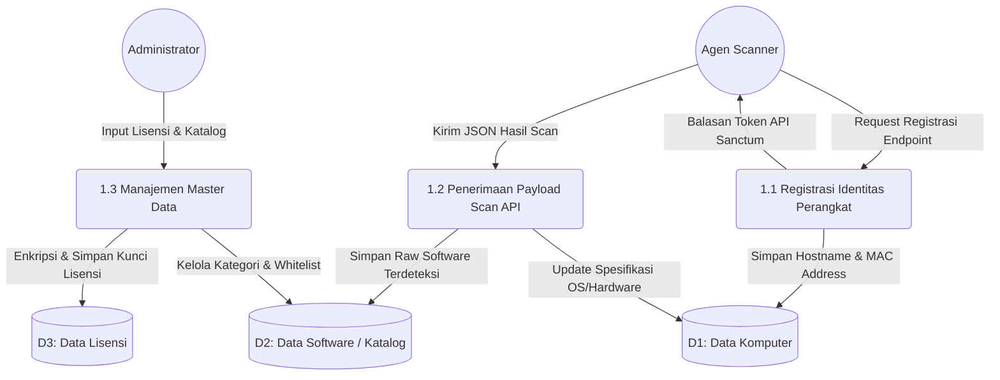
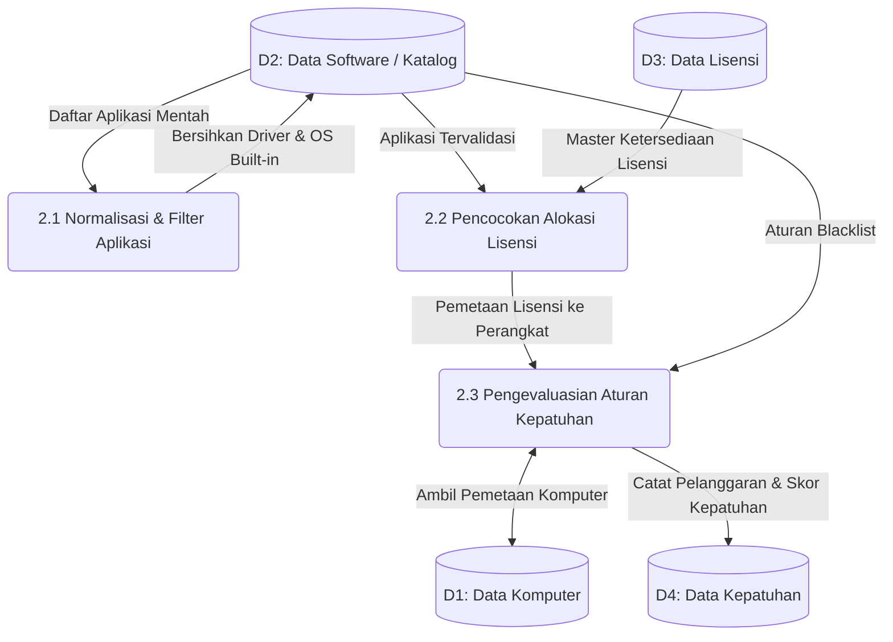
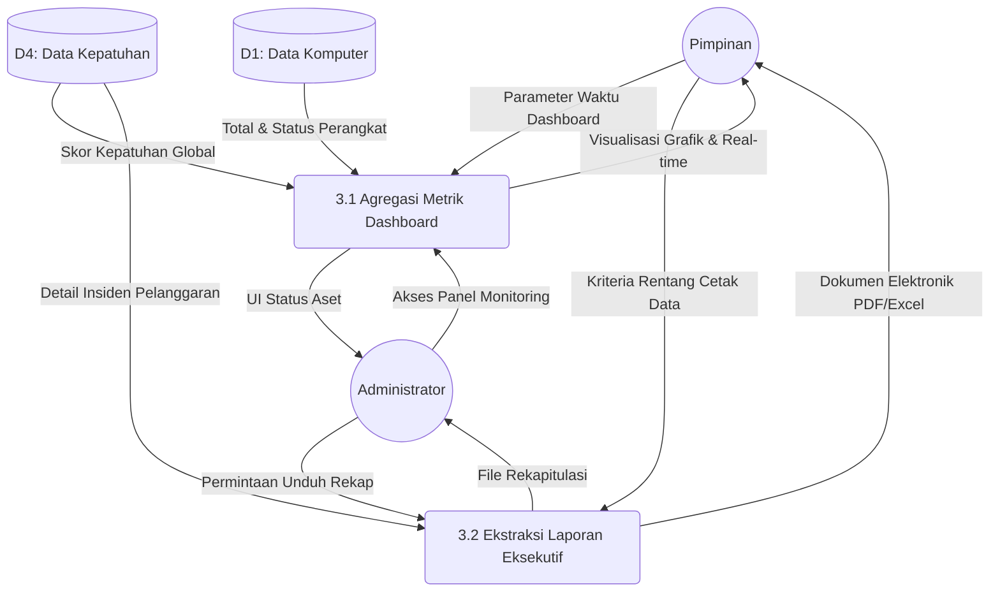

# Data Flow Diagram (DFD) Level 2 - Sistem Informasi Manifest Lisensi Perangkat Lunak untuk Mencegah Pelanggaran Hak Cipta di Lingkungan USN Kolaka

Data Flow Diagram (DFD) Level 2 merupakan bentuk dekomposisi atau penjabaran lebih detail dari masing-masing proses utama yang terdapat pada DFD Level 1. Dokumen ini disusun untuk menjelaskan spesifikasi alur data secara mendalam dari fase input, pengolahan, hingga output, sesuai dengan arsitektur *backend* aplikasi.

---

## 1. DFD Level 2 - Rincian Proses 1.0 (Proses Input Data)

Proses ini menguraikan tahapan masuknya data ke dalam sistem, yang terbagi menjadi penerimaan data secara mesin otomatis (*machine-to-machine*) melalui API dan input manual dari administrator sistem.

### Diagram

### Penjelasan Sub-Proses 1.0:
*   **1.1 Registrasi Identitas Perangkat:** Komputer klien (*Agen Scanner*) memanggil API registrasi untuk pertama kalinya. Sistem akan mencatat identitas unik (seperti *Hostname* dan *MAC Address*) ke tabel *Computers* (D1) dan mengembalikan Token Akses (Sanctum) sebagai otentikasi komunikasi selanjutnya.
*   **1.2 Penerimaan Payload Scan API:** Agen secara berkala mengirimkan paket data (*payload*) berisi detail sistem perangkat dan daftar aplikasi terinstal. Proses ini akan memperbarui status *hardware* di penyimpan data (D1) dan menampung daftar mentah *software* (D2) untuk menunggu antrean diproses.
*   **1.3 Manajemen Master Data:** Proses penginputan manual yang dilakukan oleh Administrator melalui *Web Panel*, meliputi pengelolaan katalog perangkat lunak (menetapkan *whitelist/blacklist*) pada (D2) dan mendaftarkan *Product Key* lisensi yang langsung dienkripsi sebelum disimpan ke dalam inventaris (D3).

---

## 2. DFD Level 2 - Rincian Proses 2.0 (Proses Pengolahan & Validasi)

Tahap ini mewakili *core engine* (mesin utama) pada arsitektur sistem (memanfaatkan sistem *Background Job / Queue* Laravel). Proses ini bersifat internal tanpa intervensi langsung dari entitas luar, karena bekerja berdasarkan data yang telah masuk sebelumnya.

### Diagram

### Penjelasan Sub-Proses 2.0:
*   **2.1 Normalisasi & Filter Aplikasi:** Mengeksekusi *Service* penyaringan untuk mengeliminasi program-program yang bukan perangkat lunak aplikasi (misal: *driver* sistem, pembaruan keamanan, atau komponen bawaan OS) berdasarkan aturan *Katalog* (D2) sehingga menyisakan perangkat lunak yang relevan untuk diaudit.
*   **2.2 Pencocokan Alokasi Lisensi:** Mengevaluasi perangkat lunak berbayar yang ditemukan dengan data inventaris lisensi (D3). Proses ini melakukan *mapping* secara logis untuk menentukan apakah perangkat tersebut memiliki hak alokasi lisensi yang valid.
*   **2.3 Pengevaluasian Aturan Kepatuhan:** Tahap akhir pengolahan di mana sistem mengkalkulasi temuan. Jika ditemukan perangkat lunak yang masuk kategori *Blacklist* (aplikasi bajakan), atau perangkat lunak komersial tanpa kuota lisensi, sistem akan menurunkan persentase kepatuhan. Hasil evaluasi final kemudian disimpan secara permanen pada log *Compliance Reports* (D4).

---

## 3. DFD Level 2 - Rincian Proses 3.0 (Proses Output & Pelaporan)

Proses ini menggambarkan bagaimana hasil akhir kalkulasi dari sistem diproyeksikan menjadi informasi visual dan dokumentasi pelaporan yang berguna bagi pengambil keputusan (Pimpinan) dan pengelola (Administrator).

### Diagram

### Penjelasan Sub-Proses 3.0:
*   **3.1 Agregasi Metrik Dashboard:** Sistem menarik agregat data perangkat (D1) dan skor kepatuhan terbaru (D4) untuk dirender menjadi grafik antarmuka (*Dashboard*). Pimpinan dan Administrator dapat memberikan *input filter* dinamis untuk melihat metrik secara spesifik (berdasarkan periode waktu atau lokasi departemen).
*   **3.2 Ekstraksi Laporan Eksekutif:** Fasilitas generator dokumen resmi institusi. Berdasarkan permintaan Pimpinan atau Administrator, sistem mengumpulkan rincian insiden kepatuhan, temuan aplikasi ilegal, dan status lisensi dari penyimpan data (D4) menjadi berkas statis terstruktur (format *PDF* atau *Spreadsheet Excel*) sebagai bentuk laporan pertanggungjawaban audit aset teknologi informasi.
