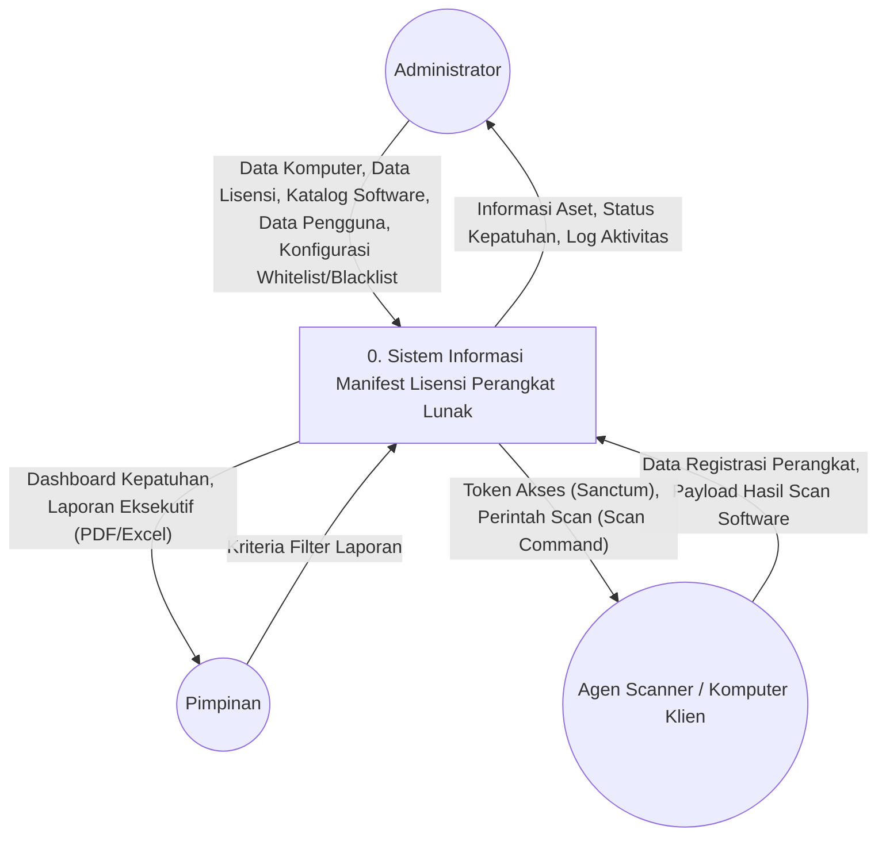

# Diagram Konteks (DFD Level 0) - Sistem Informasi Manifest Lisensi Perangkat Lunak untuk Mencegah Pelanggaran Hak Cipta di Lingkungan USN Kolaka

Berikut adalah rancangan Diagram Konteks (sering juga disebut DFD Level 0) beserta penjelasannya yang disusun dengan gaya bahasa akademis, sangat cocok untuk dimasukkan ke dalam dokumen skripsi.

## Diagram Konteks

## Penjelasan Entitas Eksternal

**Diagram Konteks (Data Flow Diagram Level 0)** di atas menggambarkan sistem sebagai satu kesatuan proses utama yang berinteraksi dengan lingkungan luarnya, yaitu entitas eksternal. Terdapat tiga entitas eksternal utama yang terlibat dalam **Sistem Informasi Manifest Lisensi Perangkat Lunak untuk Mencegah Pelanggaran Hak Cipta di Lingkungan USN Kolaka**, yaitu:

### 1. Administrator (Admin)
*   **Definisi:** Merupakan aktor manusia yang bertugas mengelola keseluruhan master data di dalam sistem, serta memastikan sistem beroperasi sesuai dengan kebijakan instansi.
*   **Aliran Data Masuk (ke Sistem):** Admin memberikan *input* berupa penambahan atau modifikasi *Data Komputer* secara manual, *Data Lisensi* (mencakup kunci lisensi yang dienkripsi dan masa aktif), *Katalog Software*, *Data Pengguna* sistem, dan penentuan *Konfigurasi Whitelist/Blacklist* perangkat lunak bajakan atau terlarang.
*   **Aliran Data Keluar (dari Sistem):** Sistem memberikan *output* berupa *Informasi Detail Aset*, *Status Kepatuhan* setiap komputer yang terhubung, dan *Log Aktivitas* sistem untuk keperluan audit.

### 2. Pimpinan
*   **Definisi:** Merupakan aktor manajerial dari pihak universitas (USN Kolaka) yang membutuhkan akses terhadap sistem hanya untuk memantau, menganalisis, dan mengambil keputusan strategis (memiliki hak akses *read-only*).
*   **Aliran Data Masuk (ke Sistem):** Pimpinan memberikan *input* berupa parameter *Kriteria Filter Laporan* saat ingin mencari atau memfilter data berdasarkan rentang waktu atau departemen.
*   **Aliran Data Keluar (dari Sistem):** Sistem menyajikan ringkasan visual berupa *Dashboard Kepatuhan* secara *real-time*, dan dokumen *Laporan Eksekutif* (dalam format PDF/Excel) mengenai status kepatuhan lisensi dan penemuan perangkat lunak ilegal pada lingkungan kampus.

### 3. Agen Scanner (Komputer Klien)
*   **Definisi:** Merupakan entitas perangkat (*machine-to-machine*) berupa *script* atau agen yang terpasang di setiap komputer inventaris. Entitas ini berkomunikasi dengan sistem utama melalui *REST API*.
*   **Aliran Data Masuk (ke Sistem):** Agen secara otomatis mengirimkan *Data Registrasi Perangkat* pada saat instalasi pertama untuk mendapatkan akses, dan secara berkala mengirimkan *Payload Hasil Scan Software* yang berisi daftar aplikasi yang terinstal pada komputer klien tersebut.
*   **Aliran Data Keluar (dari Sistem):** Sistem akan merespons registrasi dengan memberikan *Token Akses (Sanctum)*, serta memberikan *Perintah Scan (Scan Command)* apabila ada permintaan *scanning* jarak jauh (*remote poll*) dari administrator.
