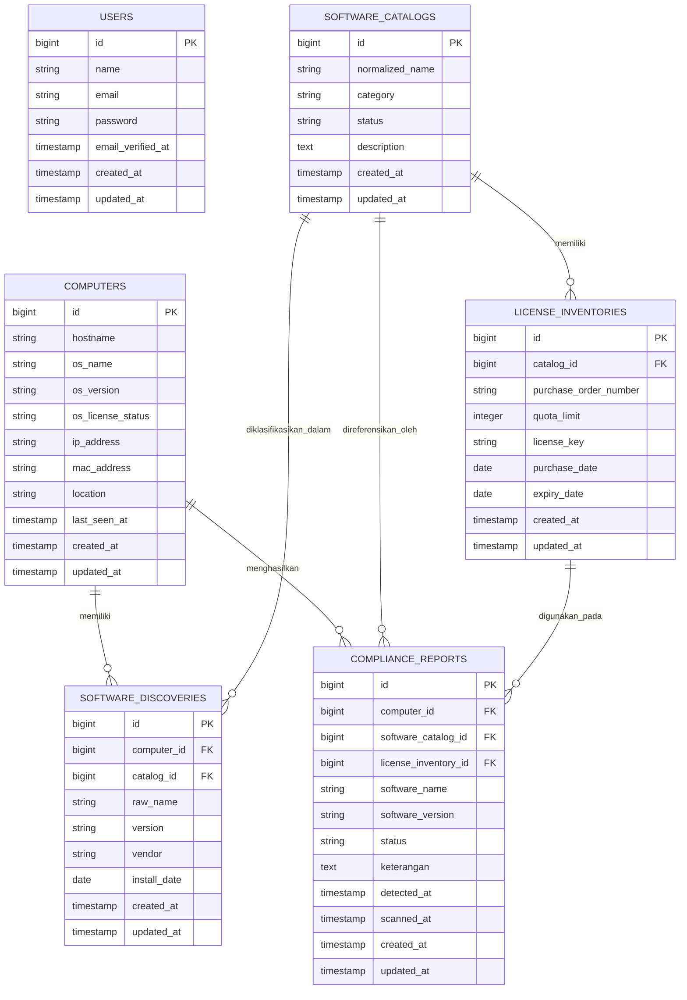

# Entity Relationship Diagram (ERD)
## Sistem Informasi Manifest Lisensi Perangkat Lunak untuk Mencegah Pelanggaran Hak Cipta di Lingkungan USN Kolaka

Berikut adalah perancangan *Entity Relationship Diagram* (ERD) yang memodelkan struktur basis data untuk sistem pada penelitian ini.

---

## Deskripsi Akademis ERD

Pemodelan data menggunakan ERD ini dirancang untuk memfasilitasi penemuan perangkat lunak secara otomatis (*automated discovery*) dan evaluasi kepatuhan lisensi (*compliance checking*).

### 1. Entitas Utama
1. **USERS:** Mengelola autentikasi dan otorisasi (RBAC) administrator. Tidak memiliki relasi langsung (*Foreign Key*) pada struktur transaksional karena pelacakan aktivitas data ditangani terpisah via mekanisme *Activity Log* polimorfik.
2. **COMPUTERS:** Mencatat identitas dan spesifikasi jaringan dari perangkat (agen) yang diaudit, sekaligus bertindak sebagai entitas yang diautentikasi (via *Sanctum*).
3. **SOFTWARE_CATALOGS:** Merupakan *Master Data* referensi yang berisi daftar perangkat lunak terstandarisasi beserta klasifikasi status lisensinya.
4. **LICENSE_INVENTORIES:** Inventaris yang mencatat kepemilikan lisensi komersial USN Kolaka, mencakup kuota dan *license key* terenkripsi.
5. **SOFTWARE_DISCOVERIES:** Menyimpan data mentah temuan perangkat lunak dari hasil pemindaian masing-masing komputer klien.
6. **COMPLIANCE_REPORTS:** Menyimpan rekam jejak akhir analisis kepatuhan yang menentukan status legalitas (misal: *Compliant*, *Tidak Berlisensi*) dari setiap instalasi perangkat lunak.

### 2. Aturan Bisnis dan Relasi (Kardinalitas)
1. **COMPUTERS (1) ke SOFTWARE_DISCOVERIES (M):** Satu komputer memiliki banyak catatan temuan instalasi perangkat lunak.
2. **SOFTWARE_CATALOGS (1) ke SOFTWARE_DISCOVERIES (M):** Satu entitas di katalog utama merepresentasikan banyak temuan instalasi perangkat lunak sejenis di berbagai komputer.
3. **SOFTWARE_CATALOGS (1) ke LICENSE_INVENTORIES (M):** Satu entitas perangkat lunak komersial pada katalog dapat memiliki banyak catatan/dokumen pembelian lisensi.
4. **COMPUTERS (1) ke COMPLIANCE_REPORTS (M):** Satu komputer menghasilkan banyak rincian laporan kepatuhan (berdasarkan aplikasi yang terinstal).
5. **LICENSE_INVENTORIES (1) ke COMPLIANCE_REPORTS (M):** Satu aset lisensi komersial dapat dialokasikan (digunakan) pada banyak laporan kepatuhan, selama batas kuota terpenuhi.
6. **SOFTWARE_CATALOGS (1) ke COMPLIANCE_REPORTS (M):** Satu rujukan dari katalog utama direferensikan oleh banyak laporan kepatuhan di seluruh sistem.