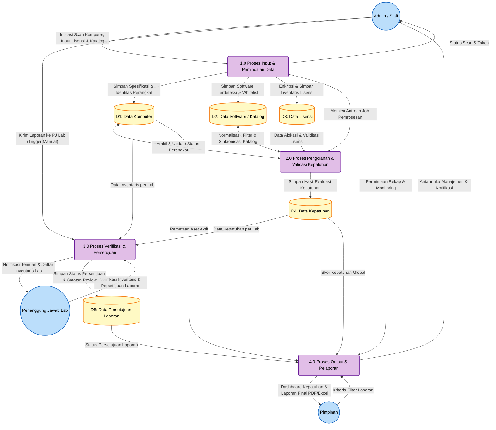

# Data Flow Diagram (DFD) Level 1 — REVISI

## Sistem Informasi Manifest Lisensi Perangkat Lunak untuk Mencegah Pelanggaran Hak Cipta di Lingkungan USN Kolaka

DFD Level 1 revisi ini mendekomposisi proses tunggal pada Diagram Konteks menjadi **4 Proses Utama** yang mencerminkan alur kerja baru dengan tiga entitas: Admin/Staff, PJ Lab, dan Pimpinan. Penambahan Proses 4.0 (Verifikasi & Persetujuan) merupakan konsekuensi dari penambahan peran PJ Lab sebagai peninjau laporan.

---

## Diagram DFD Level 1 (Revisi — 4 Proses Utama)

---

## Penjelasan Proses DFD Level 1

### 1.0 Proses Input & Pemindaian Data

- **Deskripsi:** Proses ini menangani seluruh pintu masuk data ke dalam sistem. Pada versi revisi ini, Admin/Staff bertanggung jawab penuh atas operasional *scanning* komputer (yang sebelumnya direpresentasikan sebagai entitas "Agen Scanner" yang terpisah). Admin/Staff menjalankan *tools scanner* di setiap komputer, lalu data hasil scan masuk ke sistem melalui API.
- **Aktivitas Utama:**
  - Menjalankan *tools scanner* di komputer klien laboratorium (registrasi perangkat, pengumpulan data hardware & software).
  - Menginisiasi permintaan scan secara manual (satu per satu atau massal) melalui panel web.
  - Mendaftarkan dan mengelola data lisensi (kunci lisensi terenkripsi, masa berlaku, bukti pembelian).
  - Mengelola katalog perangkat lunak (kategori, whitelist, blacklist).
- **Data Store Terkait:** D1 (Data Komputer), D2 (Data Software), D3 (Data Lisensi).
- **Perubahan dari Versi Lama:** Agen Scanner bukan lagi entitas eksternal yang mengirim data secara mandiri. Seluruh proses scanning diinisiasi dan dikelola oleh Admin/Staff.

### 2.0 Proses Pengolahan & Validasi Kepatuhan

- **Deskripsi:** Proses inti (*core engine*) yang melakukan kalkulasi logika bisnis, normalisasi data, dan pencocokan aturan kepatuhan secara otomatis menggunakan sistem antrean (*queue/background jobs*). Proses ini bersifat internal tanpa intervensi langsung dari entitas luar.
- **Aktivitas Utama:**
  - **Normalisasi & Penyaringan Software:** Menyingkirkan komponen bawaan OS, driver, dan pembaruan sistem; menormalisasi nama software berdasarkan katalog.
  - **Validasi Lisensi:** Mencocokkan software komersial yang ditemukan dengan ketersediaan inventaris lisensi (kuota, masa berlaku).
  - **Deteksi Pelanggaran:** Memeriksa apakah terdapat instalasi perangkat lunak terlarang (blacklist: KMSPico, uTorrent, dll).
  - **Kalkulasi Skor Kepatuhan:** Menghitung persentase kepatuhan per komputer dan secara global.
- **Data Store Terkait:** D1, D2, D3 (sebagai input), D4 (sebagai output evaluasi).
- **Perubahan dari Versi Lama:** Tidak ada perubahan signifikan pada logika pengolahan inti.

### 3.0 Proses Verifikasi & Persetujuan (BARU)

- **Deskripsi:** Proses baru yang merupakan konsekuensi dari penambahan peran PJ Lab. Proses ini menjadi *gateway* antara hasil analisis sistem dan laporan final yang akan diterima Pimpinan. Proses ini di-trigger secara **manual oleh Admin/Staff** — ketika Admin merasa data scan sudah lengkap untuk suatu periode (misalnya akhir bulan), Admin mengirimkan laporan ke PJ Lab melalui fitur "Kirim Laporan ke PJ Lab". Pendekatan manual ini dipilih karena agent scanner berjalan harian, sehingga trigger otomatis setiap scan akan membanjiri PJ Lab dengan notifikasi.
- **Aktivitas Utama:**
  - **Pengiriman oleh Admin:** Admin/Staff mengirimkan laporan kepatuhan per lab per periode ke PJ Lab ketika data sudah siap.
  - **Review Inventaris:** PJ Lab memeriksa kelengkapan dan keakuratan data komputer serta software di laboratoriumnya.
  - **Verifikasi Temuan:** PJ Lab meninjau temuan pelanggaran dan ketidaksesuaian lisensi, termasuk preview PDF laporan final, memastikan validitas data sebelum dilaporkan.
  - **Approval/Rejection:** PJ Lab memberikan persetujuan (*approve*) atau menolak (*reject* dengan catatan wajib) laporan kepatuhan. Keputusan bersifat per lab per periode (semua atau tidak sama sekali) dan bersifat final (tidak bisa di-revoke).
  - **Pencatatan Review:** Catatan, komentar, dan rekomendasi PJ Lab disimpan untuk jejak audit.
- **Data Store Terkait:** D4 (Data Kepatuhan sebagai input), D1 (inventaris lab), D5 (Data Persetujuan Laporan sebagai output).
- **Perubahan dari Versi Lama:** Proses ini sepenuhnya baru. Sebelumnya, laporan dari Proses 2.0 langsung tersedia untuk Pimpinan tanpa verifikasi.

### 4.0 Proses Output & Pelaporan

- **Deskripsi:** Proses penyajian informasi akhir berupa visualisasi dashboard dan dokumen laporan. Pada versi revisi, **Pimpinan hanya menerima laporan yang telah disetujui oleh PJ Lab** (statusnya diverifikasi dari D5).
- **Aktivitas Utama:**
  - Menyajikan dashboard interaktif dengan metrik kepatuhan real-time.
  - Mengekspor laporan ke format PDF dan Excel.
  - Menyaring laporan berdasarkan status persetujuan PJ Lab sehingga Pimpinan hanya melihat data yang telah terverifikasi.
  - Menyajikan antarmuka monitoring untuk Admin/Staff.
- **Data Store Terkait:** D4 (Kepatuhan), D1 (Komputer), D5 (Persetujuan).
- **Perubahan dari Versi Lama:** Ditambahkan dependency ke D5 — laporan yang ditampilkan ke Pimpinan harus sudah berstatus *approved*.

---

## Perbandingan dengan DFD Level 1 Sebelumnya

| Aspek | Versi Lama | Versi Revisi |
|-------|-----------|-------------|
| Jumlah Proses | 3 (Input, Pengolahan, Output) | 4 (Input, Pengolahan, Verifikasi, Output) |
| Entitas | Admin, Pimpinan, Agen Scanner | Admin/Staff, PJ Lab, Pimpinan |
| Data Store | 4 (D1–D4) | 5 (D1–D5, tambah Data Persetujuan) |
| Proses Verifikasi | Tidak ada | 3.0 Verifikasi & Persetujuan (baru) |
| Alur ke Pimpinan | Langsung dari Proses Output | Admin kirim ke PJ Lab → PJ Lab review → Pimpinan |
| Scanning | Dilakukan oleh entitas Agen Scanner | Dilakukan oleh Admin/Staff menggunakan tools |

---

## Daftar Data Store

| Kode | Nama | Deskripsi | Tabel Database |
|------|------|-----------|----------------|
| D1 | Data Komputer | Identitas, spesifikasi hardware, OS, dan status perangkat | `computers` |
| D2 | Data Software / Katalog | Katalog software (whitelist/blacklist/kategori) dan penemuan software per komputer | `software_catalogs`, `software_discoveries` |
| D3 | Data Lisensi | Inventaris lisensi terenkripsi, masa berlaku, kuota, bukti pembelian | `license_inventories` |
| D4 | Data Kepatuhan | Hasil evaluasi kepatuhan per komputer per software | `compliance_reports` |
| D5 | Data Persetujuan Laporan | Status persetujuan, catatan review, dan riwayat verifikasi PJ Lab | `report_approvals` **(tabel baru)** |
