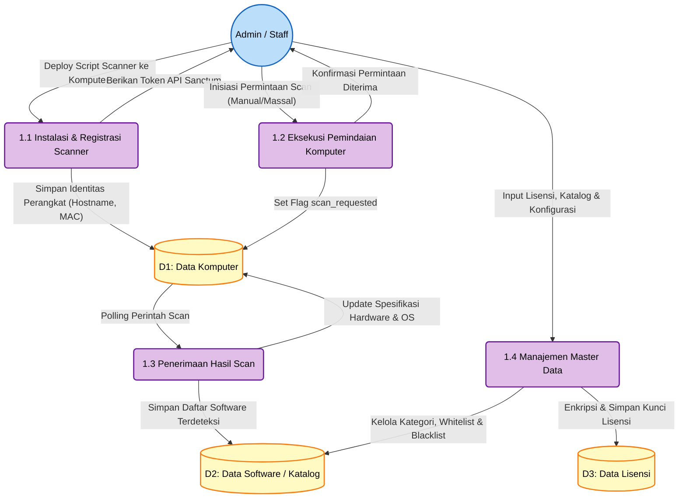
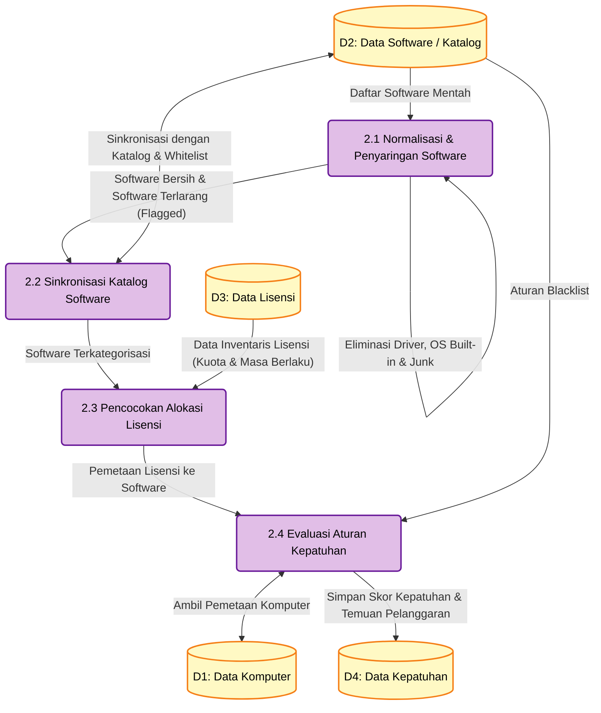
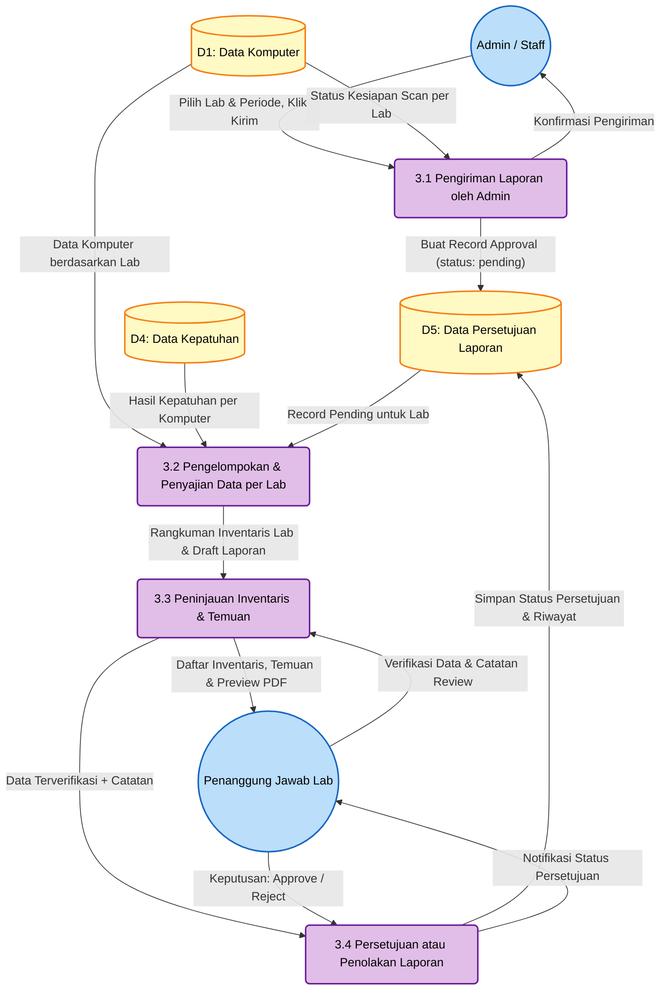
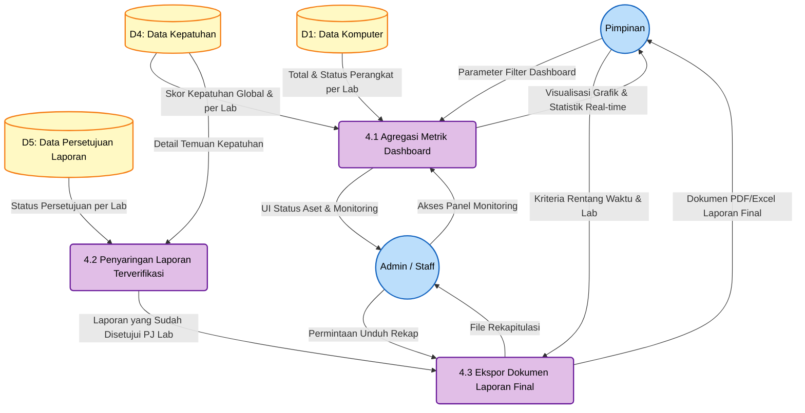

# Data Flow Diagram (DFD) Level 2 — REVISI

## Sistem Informasi Manifest Lisensi Perangkat Lunak untuk Mencegah Pelanggaran Hak Cipta di Lingkungan USN Kolaka

DFD Level 2 merupakan dekomposisi dari masing-masing proses pada DFD Level 1 revisi. Setiap proses utama dijabarkan menjadi sub-proses yang menggambarkan alur data secara lebih rinci.

---

## 1. DFD Level 2 — Rincian Proses 1.0 (Input & Pemindaian Data)

Proses ini menguraikan tahapan masuknya data ke dalam sistem. Pada versi revisi, seluruh aktivitas scanning dilakukan oleh Admin/Staff — tidak ada entitas Agen Scanner yang terpisah.

### Diagram

### Penjelasan Sub-Proses 1.0

- **1.1 Instalasi & Registrasi Scanner:** Admin/Staff memasang (*deploy*) script scanner (PowerShell) ke komputer-komputer di laboratorium. Saat script dijalankan pertama kali, komputer teregistrasi ke sistem dengan identitas unik (hostname, MAC address) dan menerima token API Sanctum untuk komunikasi selanjutnya. Proses ini menggantikan konsep "Agen Scanner sebagai entitas" — Admin/Staff yang secara aktif memasang dan mengonfigurasi tools ini.

- **1.2 Eksekusi Pemindaian Komputer:** Admin/Staff menginisiasi permintaan scan melalui panel web, baik untuk satu komputer maupun seluruh komputer secara massal. Sistem menandai komputer target dengan flag `scan_requested` pada data store D1.

- **1.3 Penerimaan Hasil Scan:** Script scanner di komputer klien secara berkala melakukan *polling* ke API untuk mengecek flag `scan_requested`. Jika ada permintaan, scanner mengumpulkan data hardware dan daftar software terinstal, lalu mengirimkan hasilnya ke sistem. Proses ini memperbarui spesifikasi perangkat di D1 dan menyimpan daftar software mentah di D2.

- **1.4 Manajemen Master Data:** Proses input manual oleh Admin/Staff melalui panel web. Meliputi: pengelolaan katalog software (menentukan kategori, whitelist, blacklist), pendaftaran kunci lisensi (*product key*) yang dienkripsi sebelum disimpan, dan konfigurasi aturan kepatuhan.

---

## 2. DFD Level 2 — Rincian Proses 2.0 (Pengolahan & Validasi Kepatuhan)

Proses inti yang berjalan secara otomatis di *background* menggunakan sistem antrean (*queue*). Tidak ada perubahan signifikan dari versi sebelumnya karena logika bisnis pengolahan data tetap sama.

### Diagram

### Penjelasan Sub-Proses 2.0

- **2.1 Normalisasi & Penyaringan Software:** `SoftwareFilterService` memproses daftar software mentah. Program-program yang bukan aplikasi (driver, pembaruan Windows, runtime redistributable, komponen OS bawaan) dieliminasi berdasarkan 70+ kata kunci dan 5 pola regex. Software yang mengandung kata kunci prioritas (Crack, Keygen, KMSPico, dll) ditandai sebagai *flagged*.

- **2.2 Sinkronisasi Katalog Software:** `SoftwareCatalogService` mencocokkan software yang lolos filter dengan database katalog. Software baru otomatis dibuat entri katalognya. Software yang cocok dengan konfigurasi whitelist (Chrome, VLC, VS Code, dll) otomatis dikategorikan. Software *flagged* otomatis masuk *blacklist*.

- **2.3 Pencocokan Alokasi Lisensi:** Untuk setiap software bertipe *Commercial*, sistem memeriksa ketersediaan lisensi di inventaris (D3). Proses ini memvalidasi: (a) apakah lisensi tersedia, (b) apakah masih dalam masa berlaku, (c) apakah kuota masih mencukupi.

- **2.4 Evaluasi Aturan Kepatuhan:** Tahap final yang menghasilkan status kepatuhan per software per komputer. Logika evaluasi berurutan: blacklist → kategori (freeware/open source = compliant) → ada/tidak lisensi → expired? → kuota penuh? → grace period (30 hari)? → compliant. Hasil disimpan ke D4 sebagai `ComplianceReport`.

---

## 3. DFD Level 2 — Rincian Proses 3.0 (Verifikasi & Persetujuan) — BARU

Proses yang sepenuhnya baru sebagai konsekuensi penambahan peran PJ Lab. Proses ini menjadi *checkpoint* antara hasil analisis otomatis dan laporan final untuk Pimpinan. Proses ini di-trigger secara manual oleh Admin/Staff — bukan otomatis setiap scan — karena agent scanner berjalan harian dan trigger otomatis akan membanjiri PJ Lab dengan notifikasi.

### Diagram

### Penjelasan Sub-Proses 3.0

- **3.1 Pengiriman Laporan oleh Admin:** Admin/Staff membuka halaman "Kirim Laporan ke PJ Lab" yang menampilkan daftar semua laboratorium beserta status kesiapan scan (berapa komputer sudah ter-scan dari total). Admin memilih laboratorium dan periode yang siap, lalu mengklik tombol "Kirim". Sistem membuat record di `report_approvals` dengan status `pending`. Admin tidak bisa mengirim ulang jika masih ada record pending untuk lab + periode yang sama. Pendekatan manual ini dipilih karena agent scanner berjalan harian — tanpa kontrol manual, PJ Lab akan dibanjiri notifikasi setiap hari.

- **3.2 Pengelompokan & Penyajian Data per Lab:** Sistem mengelompokkan data komputer dan hasil kepatuhan berdasarkan `laboratory_id`. Data hanya disajikan untuk lab yang sudah memiliki record pending di D5. Setiap PJ Lab hanya melihat data dari laboratorium yang menjadi tanggung jawabnya. Output berupa rangkuman inventaris lab dan draft laporan kepatuhan.

- **3.3 Peninjauan Inventaris & Temuan:** PJ Lab melakukan review terhadap:
  - Kelengkapan daftar komputer di laboratoriumnya (apakah semua komputer sudah ter-scan).
  - Kebenaran data software yang terdeteksi (apakah ada false positive).
  - Temuan pelanggaran (software terlarang atau tanpa lisensi).
  - **Preview PDF** — PJ Lab bisa melihat bentuk laporan final sebelum memberikan keputusan.
  - PJ Lab dapat menambahkan catatan atau keterangan tambahan pada temuan.

- **3.4 Persetujuan atau Penolakan Laporan:** PJ Lab memberikan keputusan formal:
  - **Approve**: Laporan dinyatakan valid dan siap diteruskan ke Pimpinan. Catatan review opsional. Keputusan bersifat **final** (tidak bisa di-revoke).
  - **Reject**: Laporan dikembalikan dengan catatan revisi **wajib diisi** (misalnya: data belum lengkap, perlu scan ulang, dll). Admin dapat mengirim ulang setelah perbaikan.
  - Approval bersifat **per lab per periode** — semua atau tidak sama sekali, tidak bisa approve sebagian komputer.
  - Status persetujuan beserta riwayat, catatan, dan timestamp disimpan di D5.

---

## 4. DFD Level 2 — Rincian Proses 4.0 (Output & Pelaporan)

Proses penyajian informasi akhir yang telah disesuaikan agar hanya menampilkan laporan **yang sudah disetujui** oleh PJ Lab kepada Pimpinan.

### Diagram

### Penjelasan Sub-Proses 4.0

- **4.1 Agregasi Metrik Dashboard:** Sistem mengagregasi data perangkat (D1) dan skor kepatuhan (D4) untuk ditampilkan sebagai grafik interaktif pada dashboard. Pimpinan dan Admin/Staff dapat memberikan parameter filter (periode waktu, laboratorium tertentu). Dashboard menampilkan: total komputer, distribusi OS, tingkat kepatuhan, software terbanyak, peringatan kritis.

- **4.2 Penyaringan Laporan Terverifikasi:** Sub-proses baru yang menyaring data kepatuhan berdasarkan status persetujuan dari D5. Hanya data dari laboratorium yang laporannya sudah di-*approve* oleh PJ Lab yang diteruskan ke proses ekspor. Ini memastikan Pimpinan hanya menerima laporan yang sudah terverifikasi.

- **4.3 Ekspor Dokumen Laporan Final:** Generator dokumen resmi yang menghasilkan laporan dalam format PDF dan Excel. Terdapat 5 jenis laporan: Eksekutif (ringkasan), Komputer (inventaris), Software (daftar aplikasi), Kepatuhan (compliance), dan Lisensi (status lisensi). Setiap dokumen menyertakan metadata: tanggal cetak, nama pencetak, peran, serta status persetujuan PJ Lab.

---

## Ringkasan Seluruh Sub-Proses

| Proses | Sub-Proses | Keterangan | Status |
|--------|-----------|------------|--------|
| 1.0 Input | 1.1 Instalasi & Registrasi Scanner | Deploy tools + registrasi perangkat | Revisi (tanpa entitas Agen) |
| | 1.2 Eksekusi Pemindaian Komputer | Inisiasi scan oleh Admin/Staff | Revisi |
| | 1.3 Penerimaan Hasil Scan | Terima & simpan data scan | Revisi |
| | 1.4 Manajemen Master Data | Input lisensi, katalog, konfigurasi | Tetap |
| 2.0 Pengolahan | 2.1 Normalisasi & Penyaringan Software | Filter junk & flagging | Tetap |
| | 2.2 Sinkronisasi Katalog Software | Matching dengan katalog & whitelist | Tetap |
| | 2.3 Pencocokan Alokasi Lisensi | Validasi ketersediaan lisensi | Tetap |
| | 2.4 Evaluasi Aturan Kepatuhan | Hitung skor & status kepatuhan | Tetap |
| 3.0 Verifikasi | 3.1 Pengiriman Laporan oleh Admin | Admin trigger manual kirim ke PJ Lab | **Baru** |
| | 3.2 Pengelompokan & Penyajian Data per Lab | Grouping by laboratory_id | **Baru** |
| | 3.3 Peninjauan Inventaris & Temuan | PJ Lab review + preview PDF | **Baru** |
| | 3.4 Persetujuan/Penolakan Laporan | Approve/reject (final, per lab per periode) | **Baru** |
| 4.0 Output | 4.1 Agregasi Metrik Dashboard | Visualisasi statistik | Tetap |
| | 4.2 Penyaringan Laporan Terverifikasi | Filter by approval status | **Baru** |
| | 4.3 Ekspor Dokumen Laporan Final | Generate PDF/Excel | Revisi (tambah metadata approval) |
