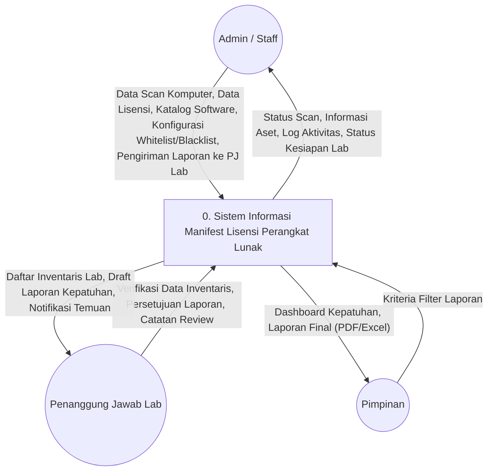

# Diagram Konteks (DFD Level 0) — REVISI

## Sistem Informasi Manifest Lisensi Perangkat Lunak untuk Mencegah Pelanggaran Hak Cipta di Lingkungan USN Kolaka

Dokumen ini merupakan revisi dari Diagram Konteks sebelumnya berdasarkan arahan dosen penguji. Perubahan utama:

1. **Entitas "Agen Scanner" dihapus** — Agen scanner adalah alat/tools, bukan aktor. Proses scanning dijalankan oleh Admin/Staff.
2. **Entitas baru "Penanggung Jawab Lab (PJ Lab)"** ditambahkan sebagai peninjau dan pengelola inventarisasi per laboratorium.
3. **Tiga entitas final**: Admin/Staff, PJ Lab, Pimpinan.

---

## Diagram Konteks (Revisi)

---

## Penjelasan Entitas Eksternal

**Diagram Konteks** di atas menggambarkan sistem sebagai satu kesatuan proses utama yang berinteraksi dengan tiga entitas eksternal. Berbeda dengan versi sebelumnya, entitas "Agen Scanner" telah dihilangkan karena agen tersebut merupakan instrumen teknis (*tools*) yang dioperasikan oleh Admin/Staff, bukan merupakan aktor independen. Selain itu, ditambahkan entitas Penanggung Jawab Lab (PJ Lab) sebagai lapisan verifikasi sebelum laporan sampai ke Pimpinan.

### 1. Admin / Staff

- **Definisi:** Aktor operasional yang bertugas menjalankan proses *scanning* perangkat lunak di setiap komputer laboratorium, mengelola master data lisensi, serta mengonfigurasi katalog perangkat lunak (whitelist/blacklist). Admin/Staff juga bertanggung jawab mengoperasikan *tools scanner* yang terpasang di komputer klien.
- **Aliran Data Masuk (ke Sistem):**
  - **Data Scan Komputer** — Menginisiasi proses scan terhadap komputer klien (baik scan manual satu per satu maupun scan massal). Data hasil scan meliputi spesifikasi hardware dan daftar software yang terinstal.
  - **Data Lisensi** — Mendaftarkan kunci lisensi (*product key*), nomor *purchase order*, masa berlaku, dan bukti pembelian ke dalam sistem.
  - **Katalog Software** — Mengelola daftar perangkat lunak beserta kategorisasinya (Freeware, Commercial, Open Source, dll).
  - **Konfigurasi Whitelist/Blacklist** — Menetapkan aturan perangkat lunak yang diizinkan dan yang terlarang/bajakan.
  - **Pengiriman Laporan ke PJ Lab** — Mengirimkan laporan kepatuhan per laboratorium per periode ke PJ Lab untuk ditinjau. Pengiriman dilakukan secara manual ketika Admin menilai data scan sudah lengkap (misalnya akhir bulan), bukan otomatis setiap scan karena agent scanner berjalan harian.
- **Aliran Data Keluar (dari Sistem):**
  - **Status Scan** — Informasi hasil pemindaian tiap komputer (berhasil, gagal, menunggu).
  - **Informasi Aset** — Detail inventaris komputer dan perangkat lunak yang terdeteksi.
  - **Log Aktivitas** — Catatan audit seluruh aktivitas yang dilakukan di dalam sistem.
  - **Status Kesiapan Lab** — Informasi kesiapan data per laboratorium (berapa komputer sudah ter-scan dari total) untuk membantu Admin memutuskan kapan mengirim laporan ke PJ Lab.

### 2. Penanggung Jawab Lab (PJ Lab)

- **Definisi:** Aktor yang bertanggung jawab atas inventarisasi dan *manifest* perangkat lunak di masing-masing laboratorium yang berada di bawah kewenangannya. PJ Lab berperan sebagai lapisan verifikasi (*reviewer*) yang memeriksa dan menyetujui hasil audit kepatuhan sebelum laporan diteruskan kepada Pimpinan. Laporan masuk ke PJ Lab **setelah Admin/Staff mengirimkannya** — bukan otomatis setelah setiap scan.
- **Aliran Data Masuk (ke Sistem):**
  - **Verifikasi Data Inventaris** — Memeriksa kelengkapan dan kebenaran data komputer serta software di laboratorium masing-masing.
  - **Persetujuan Laporan** — Memberikan persetujuan (*approval*) atau catatan revisi terhadap draft laporan kepatuhan yang dihasilkan sistem.
  - **Catatan Review** — Menambahkan keterangan atau rekomendasi terkait temuan pelanggaran di laboratoriumnya.
- **Aliran Data Keluar (dari Sistem):**
  - **Daftar Inventaris Lab** — Data komputer dan perangkat lunak yang berada di laboratorium yang menjadi tanggung jawabnya.
  - **Draft Laporan Kepatuhan** — Laporan hasil analisis sistem yang telah dikirimkan oleh Admin/Staff untuk ditinjau sebelum difinalisasi.
  - **Notifikasi Temuan** — Pemberitahuan jika ditemukan perangkat lunak terlarang atau pelanggaran lisensi di laboratoriumnya.

### 3. Pimpinan

- **Definisi:** Aktor manajerial dari pihak universitas (USN Kolaka) yang memiliki akses *read-only* terhadap laporan **yang telah disetujui** oleh PJ Lab. Pimpinan menggunakan informasi ini untuk mengambil keputusan strategis terkait kepatuhan lisensi perangkat lunak di lingkungan kampus.
- **Aliran Data Masuk (ke Sistem):**
  - **Kriteria Filter Laporan** — Parameter pencarian dan filter data berdasarkan rentang waktu, laboratorium, atau kategori tertentu.
- **Aliran Data Keluar (dari Sistem):**
  - **Dashboard Kepatuhan** — Ringkasan visual *real-time* mengenai status kepatuhan lisensi di seluruh laboratorium.
  - **Laporan Final (PDF/Excel)** — Dokumen laporan resmi yang telah melewati tahap verifikasi PJ Lab, siap untuk keperluan pertanggungjawaban dan pengambilan keputusan.

---

## Perbandingan dengan Diagram Konteks Sebelumnya

| Aspek | Versi Lama | Versi Revisi |
|-------|-----------|-------------|
| Jumlah Entitas | 3 (Admin, Pimpinan, Agen Scanner) | 3 (Admin/Staff, PJ Lab, Pimpinan) |
| Agen Scanner | Entitas eksternal mandiri | Dihilangkan (menjadi tools yang dioperasikan Admin/Staff) |
| PJ Lab | Tidak ada | Ditambahkan sebagai reviewer/verifikator laporan |
| Alur Laporan | Admin → Sistem → Pimpinan (langsung) | Admin scan → Sistem proses → Admin kirim ke PJ Lab → PJ Lab review → Pimpinan |
| Cakupan Admin | Hanya mengelola data | Mengelola data + mengoperasikan scanner + mengirim laporan ke PJ Lab |
| Akses Pimpinan | Semua laporan langsung | Hanya laporan yang sudah disetujui PJ Lab |
