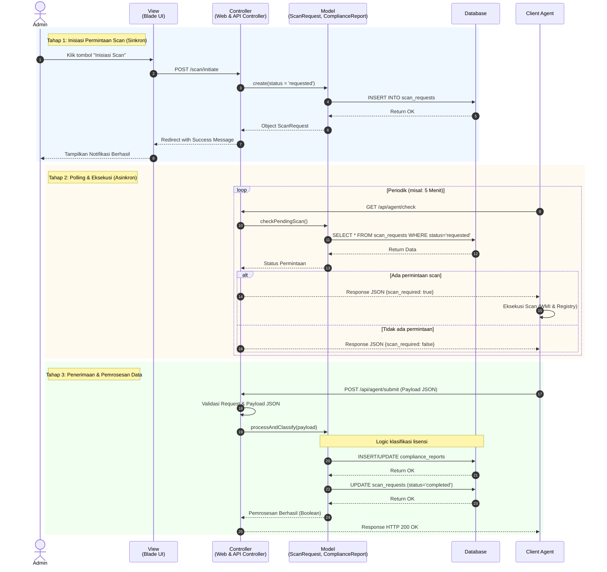

# Sequence Diagram MVC - Sistem Manifest

## Visualisasi Mermaid

## Penjelasan Akademik (Format Proposal/Skripsi)

**Penjelasan Sequence Diagram MVC - Proses Pemindaian (Scanning) Sistem Manifest**

*Sequence diagram* di atas memodelkan alur interaksi antar objek dalam proses pemindaian (*scanning*) lisensi perangkat lunak menggunakan arsitektur perangkat lunak *Model-View-Controller* (MVC). Sistem beroperasi dalam arsitektur *client-server* di mana proses utamanya dipecah menjadi tiga tahapan asinkron:

1. **Tahap Inisiasi Permintaan Scan**: 
   Aktor (Admin) berinteraksi dengan antarmuka sistem (**View**) untuk memulai proses pemindaian. Permintaan tersebut diteruskan ke **Controller** yang bertugas menangani logika HTTP *request*. Controller kemudian menginstruksikan **Model** (representasi *business logic* aplikasi) untuk merekam status permintaan baru ke dalam **Database**. Setelah data persisten tersimpan, Controller mengembalikan *response* ke View untuk memberikan umpan balik (notifikasi) visual kepada Admin.

2. **Tahap Polling dan Eksekusi Scan**:
   Mengingat sifat pemindaian yang berjalan di latar belakang klien, **Client Agent** didesain untuk secara periodik melakukan *polling* (pemeriksaan rutin) ke *endpoint* API **Controller**. Controller akan memanggil *method* pada **Model** untuk memverifikasi ketersediaan tugas pemindaian di **Database**. Jika terdeteksi adanya *flag* permintaan, Controller memberikan sinyal eksekusi kepada Agent. Agent selanjutnya akan memproses instruksi tersebut secara lokal pada mesin klien memanfaatkan *Windows Management Instrumentation* (WMI) dan *Registry*.

3. **Tahap Pengiriman dan Klasifikasi Hasil**:
   Setelah akuisisi data selesai, **Client Agent** mentransmisikan hasil pemindaian (*raw data*) dalam format JSON kembali ke **Controller**. Controller bertanggung jawab memvalidasi *payload* sebelum mendelegasikan pemrosesan inti ke **Model**. Di dalam **Model**, algoritma klasifikasi dieksekusi untuk memetakan perangkat lunak ke dalam status kepatuhan (*compliant/non-compliant*). Model kemudian menyimpan hasil akhirnya ke entitas laporan di **Database** (tabel `compliance_reports`) dan memperbarui status pemindaian menjadi selesai (*completed*).

**Kesesuaian dengan Pemisahan Tanggung Jawab (Separation of Concerns):**
Diagram ini secara ketat mematuhi prinsip desain *framework* Laravel:
* **View (Blade UI)** murni berfungsi sebagai lapisan presentasi interaktif bagi pengguna.
* **Controller (Web & API)** bertindak sebagai fasilitator komunikasi yang mengatur *routing*, *middleware*, dan validasi struktur data dari/ke *Client Agent* maupun antarmuka Admin.
* **Model (Eloquent ORM)** menangkap seluruh kompleksitas *business logic* (algoritma pencocokan lisensi) dan secara eksklusif memanipulasi entitas di dalam **Database**, sehingga memisahkan logika pengolahan dari logika transportasi data.
