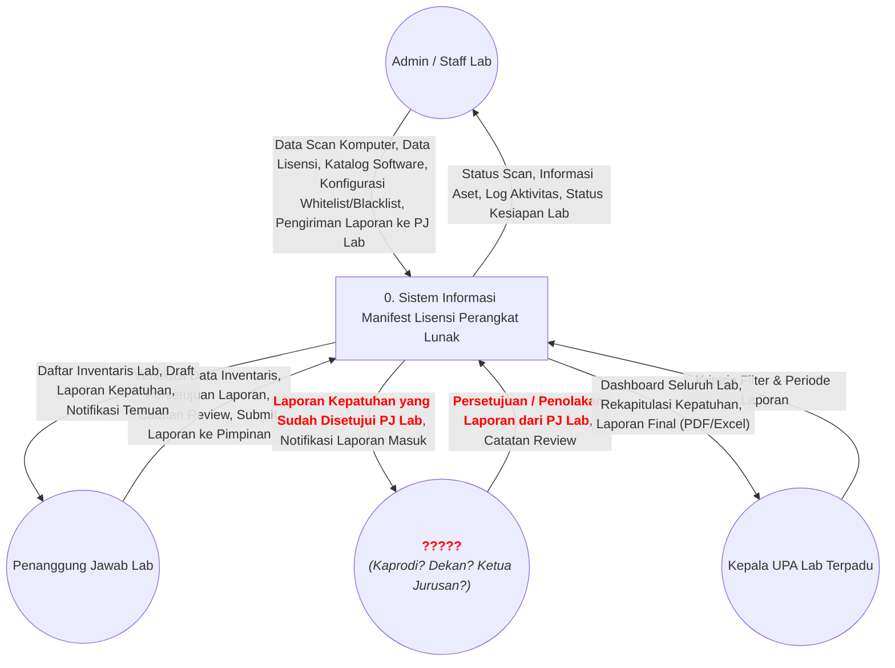

# Revisi Diagram Konteks (Opsional/Draft)

Dokumen ini berisi draf Diagram Konteks untuk skenario di mana terdapat pimpinan verifikator di antara Penanggung Jawab (PJ) Lab dan Kepala UPA Lab Terpadu. Diagram ini dibuat untuk bahan diskusi dengan dosen penguji atau koordinator lab untuk memastikan jabatan hierarkis yang tepat di Universitas Sembilanbelas November (USN) Kolaka.

## Diagram Konteks (Level 0) — Menunggu Konfirmasi Entitas

## Penjelasan Draft Alur Berjenjang (3 Level Verifikasi)

Jika memang diwajibkan ada persetujuan pimpinan di atas PJ Lab sebelum masuk ke rekapitulasi Kepala UPA, maka alur sistem (*workflow approval*) akan berubah menjadi:

1. **Admin / Staff Lab** — melakukan *scanning* dan mengirimkan draf awal laporan lab.
2. **Penanggung Jawab (PJ) Lab** — melakukan review tahap 1 (memverifikasi inventaris dan temuan) lalu menyetujui (*approve*) laporan.
3. **Pimpinan (?????)** — melakukan review tahap 2. Pimpinan ini (yang jabatannya masih harus dikonfirmasi, misalnya Dekan atau Ketua Jurusan) menerima notifikasi bahwa PJ Lab telah menyetujui laporan. Pimpinan kemudian memberikan persetujuan final (pengesahan tingkat fakultas/jurusan).
4. **Kepala UPA Lab Terpadu** — hanya menerima laporan yang telah disahkan secara penuh (telah melewati tahap 2 dan 3).

## Pertanyaan untuk Dosen Penguji / Koordinator Lab

Untuk mematangkan rancangan sistem, mohon arahannya terkait dua hal berikut:

1. **Siapakah pejabat struktural yang tepat** untuk mengisi posisi "Pimpinan" di atas PJ Lab dalam konteks administrasi USN Kolaka? (Apakah Kepala Program Studi, Dekan Fakultas, atau jabatan lain?)
2. **Apakah pimpinan tersebut memiliki hak untuk menolak (*reject*) laporan** yang sudah disetujui oleh PJ Lab, ataukah posisinya sekadar "Mengetahui" (*Acknowledged by*)? Jika berhak menolak, laporan akan dikembalikan ke siapa (PJ Lab atau langsung ke Admin)?

*(Diagram flow map lengkap akan disesuaikan setelah mendapatkan kepastian mengenai jabatan dan wewenang entitas tersebut).*
