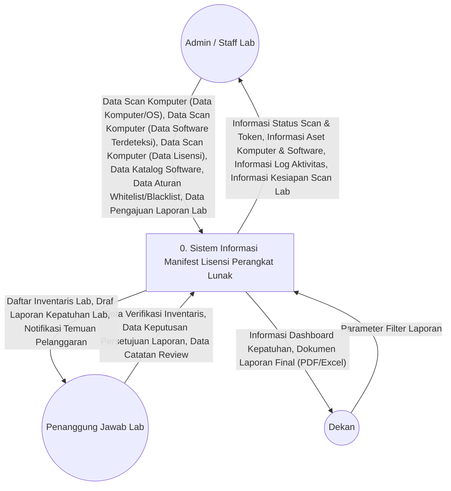
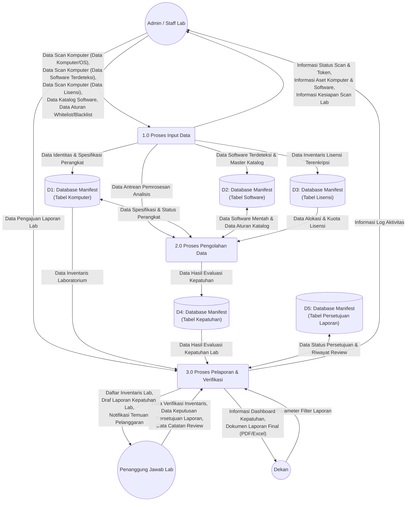
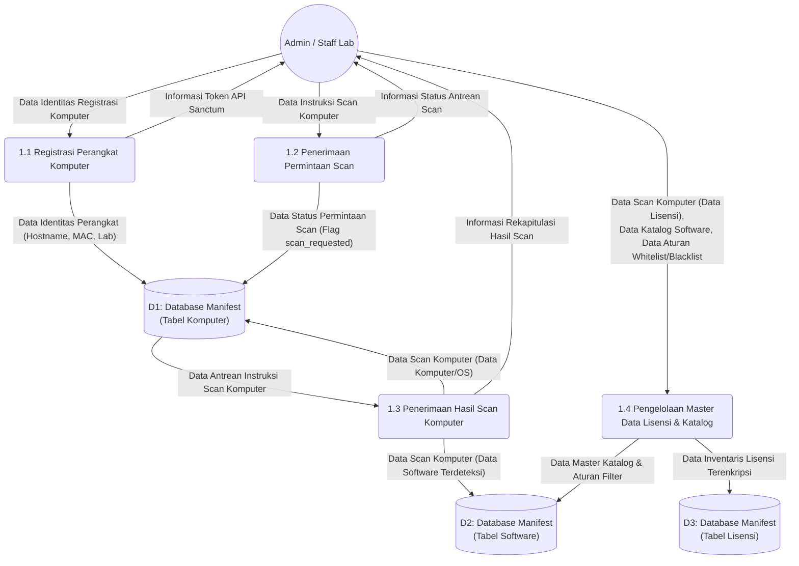
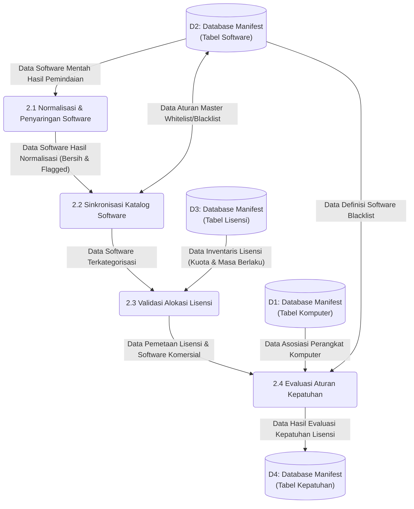
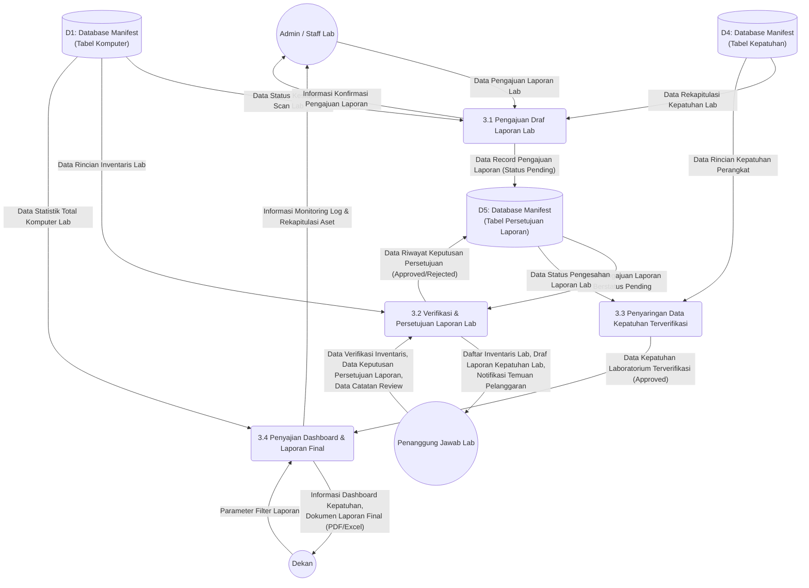
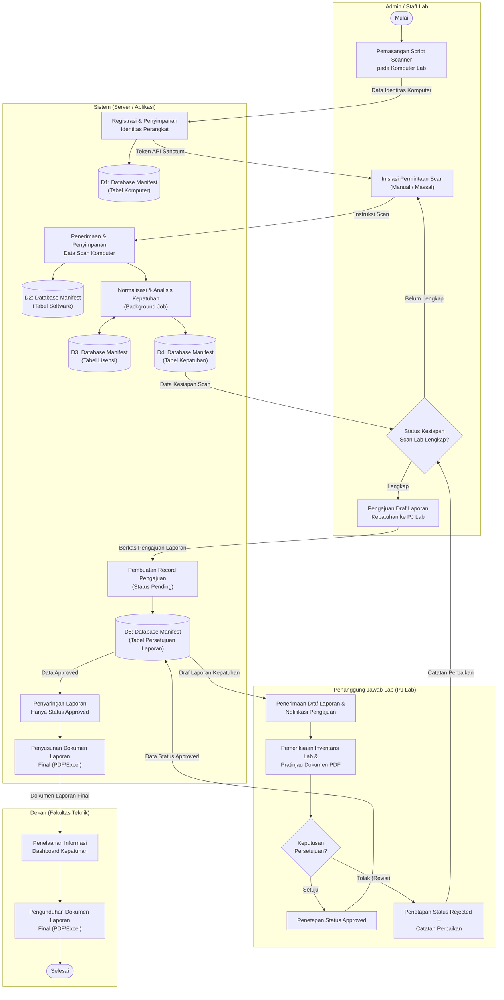

# Revisi DFD Level 0 - Level 2 & Flow Map (Versi 3 — Sesuai Bimbingan Dosen)

## Sistem Informasi Manifest Lisensi Perangkat Lunak untuk Mencegah Pelanggaran Hak Cipta di Lingkungan USN Kolaka

Dokumen ini merupakan hasil perbaikan diagram perancangan sistem (*Data Flow Diagram* / DFD dan *Flow Map*) berdasarkan arahan bimbingan dosen:
1. **Entitas Eksternal:** Ditetapkan secara konsisten menjadi **Dekan** (pihak eksekutif penerima laporan akhir / *read-only*), **Admin / Staff Lab** (pengelola dan operator sistem), dan **Penanggung Jawab Lab (PJ Lab)** (verifikator inventaris lab).
2. **Kaidah Penamaan Arus Data (*Data Flow*):** Seluruh arus data menggunakan **kata benda murni** (menghilangkan kata kerja seperti *deploy*, *simpan*, *inisiasi*, *pilih*, *berikan* yang merupakan ranah proses).
3. **Spesifikasi Data Scan:** Mengadopsi penamaan bertingkat konsisten:
   - `Data Scan Komputer (Data Komputer/OS)`
   - `Data Scan Komputer (Data Software Terdeteksi)`
   - `Data Scan Komputer (Data Lisensi)`
4. **Kaidah Penamaan Data Store:** Menggunakan format terpadu basis data dan tabel: `Database Manifest (Tabel NamaTabel)`.
5. **Keseimbangan Arus Data (*Balancing*):** Setiap arus data masuk dan keluar pada Diagram Konteks memiliki korespondensi yang identik di DFD Level 1.

---

### Keputusan Desain

| Aspek | Keputusan Revisi | Keterangan |
|---|---|---|
| Jumlah Entitas | 3 Entitas | Admin / Staff Lab, Penanggung Jawab Lab (PJ Lab), Dekan |
| Entitas Eksekutif | **Dekan** | Penerima laporan akhir tingkat fakultas (*read-only*) |
| Agen Scanner | Bukan entitas | Merupakan *tools* / instrumen yang dioperasikan oleh Admin / Staff Lab |
| Jumlah Proses Level 1 | 3 Proses Utama | 1.0 Input Data, 2.0 Pengolahan Data, 3.0 Pelaporan & Verifikasi |
| Standar Data Store | `Database Manifest (Tabel ...)` | D1: Tabel Komputer, D2: Tabel Software, D3: Tabel Lisensi, D4: Tabel Kepatuhan, D5: Tabel Persetujuan Laporan |

### Alur Pelaporan Berjenjang

```
Admin / Staff Lab   →  Pemindaian komputer, input master data, pengiriman draf laporan lab
        ↓
PJ Lab              →  Verifikasi data inventaris & temuan, persetujuan (approve/reject) laporan lab
        ↓ (setelah approved)
Dekan               →  Penerimaan & penelaahan laporan final kepatuhan (read-only)
```

---

## 1. Diagram Konteks (DFD Level 0)

### 1.1 Diagram Konteks (Mermaid)


**Gambar 3.3 Diagram Konteks**

### 1.2 Penjelasan Entitas Eksternal

#### 1. Admin / Staff Lab
Aktor operasional yang mengelola seluruh konfigurasi master data, mengoperasikan instrumen pemindaian (*scanner*) pada komputer klien laboratorium, dan mengajukan draf laporan kepatuhan laboratorium.
- **Arus Data Masuk (ke Sistem):**
  - *Data Scan Komputer (Data Komputer/OS)*: Spesifikasi perangkat keras dan sistem operasi hasil pemindaian.
  - *Data Scan Komputer (Data Software Terdeteksi)*: Daftar instalasi perangkat lunak hasil pemindaian.
  - *Data Scan Komputer (Data Lisensi)*: Informasi lisensi/OEM yang terbaca saat pemindaian.
  - *Data Katalog Software*: Master entri perangkat lunak komersial, freeware, maupun open-source.
  - *Data Aturan Whitelist/Blacklist*: Konfigurasi kata kunci perangkat lunak terlarang dan diizinkan.
  - *Data Pengajuan Laporan Lab*: Berkas pengajuan draf laporan per lab per periode ke PJ Lab.
- **Arus Data Keluar (dari Sistem):**
  - *Informasi Status Scan & Token*: Bukti token API Sanctum dan respons status pemindaian.
  - *Informasi Aset Komputer & Software*: Data rekapitulasi spesifikasi komputer dan software terdeteksi.
  - *Informasi Log Aktivitas*: Catatan rekam jejak audit perubahan sistem.
  - *Informasi Kesiapan Scan Lab*: Rekapitulasi persentase komputer yang telah selesai dipindai per lab.

#### 2. Penanggung Jawab Lab (PJ Lab)
Aktor pengawas tingkat laboratorium (Koordinator Lab/Prodi) yang bertugas mengevaluasi kesesuaian fisik inventaris dan temuan audit perangkat lunak.
- **Arus Data Masuk (ke Sistem):**
  - *Data Verifikasi Inventaris*: Koreksi atau penyesuaian validasi aset inventaris lab.
  - *Data Keputusan Persetujuan Laporan*: Status persetujuan resmi (*Approve* atau *Reject*).
  - *Data Catatan Review*: Catatan perbaikan dan rekomendasi tindak lanjut hasil audit.
- **Arus Data Keluar (dari Sistem):**
  - *Daftar Inventaris Lab*: Rincian perangkat dan aplikasi yang ada pada laboratorium bersangkutan.
  - *Draf Laporan Kepatuhan Lab*: Berkas laporan komprehensif berstatus *pending* untuk ditinjau.
  - *Notifikasi Temuan Pelanggaran*: Pemberitahuan perangkat lunak ilegal (*blacklist*) atau ketidaksesuaian lisensi.

#### 3. Dekan
Pimpinan tingkat fakultas (FTI USN Kolaka) yang menerima laporan eksekutif kepatuhan hak cipta secara *read-only*.
- **Arus Data Masuk (ke Sistem):**
  - *Parameter Filter Laporan*: Kriteria penyaringan periode waktu dan unit laboratorium.
- **Arus Data Keluar (dari Sistem):**
  - *Informasi Dashboard Kepatuhan*: Tampilan metrik persentase kepatuhan lisensi dan statistik pelanggaran.
  - *Dokumen Laporan Final (PDF/Excel)*: Dokumen resmi laporan kepatuhan yang telah disahkan oleh PJ Lab.

---

## 2. Data Flow Diagram Level 1

### 2.1 Diagram Level 1 (Mermaid)


**Gambar 3.4 Data Flow Diagram Level 1**

### 2.2 Penjelasan Proses DFD Level 1

#### 1.0 Proses Input Data (Penerimaan & Registrasi)
- **Fungsi:** Mengelola registrasi komputer lab, menampung arus hasil pemindaian scanner, serta menginput master katalog perangkat lunak dan inventaris lisensi.
- **Data Masuk:** *Data Scan Komputer (Data Komputer/OS)*, *Data Scan Komputer (Data Software Terdeteksi)*, *Data Scan Komputer (Data Lisensi)*, *Data Katalog Software*, *Data Aturan Whitelist/Blacklist*.
- **Data Keluar:** *Informasi Status Scan & Token*, *Informasi Aset Komputer & Software*, *Informasi Kesiapan Scan Lab*, serta data terstruktur ke data store D1, D2, D3. Memicu antrean background job (*Data Antrean Pemrosesan Analisis*) ke proses 2.0.
- **Data Store Terkait:** D1 (Tabel Komputer), D2 (Tabel Software), D3 (Tabel Lisensi).

#### 2.0 Proses Pengolahan Data (Analisis & Evaluasi Otomatis)
- **Fungsi:** Menjalankan normalisasi nama software, penyaringan komponen sistem (*junk/driver*), penandaan software terlarang (*blacklist*), pencocokan alokasi lisensi, serta kalkulasi status kepatuhan secara otomatis.
- **Data Masuk:** *Data Antrean Pemrosesan Analisis* (dari P1.0), *Data Software Mentah* (D2), *Data Alokasi Lisensi* (D3), *Data Spesifikasi Komputer* (D1).
- **Data Keluar:** *Data Hasil Evaluasi Kepatuhan* yang disimpan ke D4.
- **Data Store Terkait:** D1, D2, D3, D4 (Tabel Kepatuhan).

#### 3.0 Proses Pelaporan & Verifikasi (Pengesahan Berjenjang & Penyajian)
- **Fungsi:** Mengelola pengajuan draf laporan oleh Admin, memfasilitasi verifikasi dan persetujuan oleh PJ Lab, menyaring data kepatuhan yang berstatus *approved*, dan menyajikan dokumen laporan final kepada Dekan.
- **Data Masuk:** *Data Pengajuan Laporan Lab* (dari Staff), *Data Keputusan Persetujuan Laporan* dan *Data Catatan Review* (dari PJ Lab), *Parameter Filter Laporan* (dari Dekan), serta data dari D1, D4, D5.
- **Data Keluar:** *Draf Laporan Kepatuhan Lab* dan *Notifikasi Temuan* ke PJ Lab, *Dokumen Laporan Final (PDF/Excel)* dan *Dashboard Kepatuhan* ke Dekan, *Informasi Log Aktivitas* ke Staff.
- **Data Store Terkait:** D1, D4, D5 (Tabel Persetujuan Laporan).

### 2.3 Daftar Data Store Terpadu

| Kode | Penamaan Notasi Data Store | Deskripsi Isi Penyimpanan | Tabel Terkait dalam Database |
|---|---|---|---|
| **D1** | Database Manifest (Tabel Komputer) | Identitas fisik/jaringan (Hostname, MAC, IP), spesifikasi hardware, OS, lokasi lab, dan status kesiapan scan. | `computers` |
| **D2** | Database Manifest (Tabel Software) | Master katalog software (whitelist, blacklist, kategori komersial/freeware), serta tabel temuan software terinstal per komputer. | `software_catalogs`, `software_discoveries` |
| **D3** | Database Manifest (Tabel Lisensi) | Inventaris lisensi terenkripsi, batas kuota aktivasi, masa berlaku, dan dokumen bukti perolehan lisensi. | `license_inventories` |
| **D4** | Database Manifest (Tabel Kepatuhan) | Rekapitulasi hasil analisis kepatuhan per komputer dan software (status: compliant, non-compliant, expired, unverified). | `compliance_reports` |
| **D5** | Database Manifest (Tabel Persetujuan Laporan) | Status verifikasi pengajuan laporan lab (pending, approved, rejected), catatan perbaikan, serta jejak audit persetujuan PJ Lab. | `report_approvals` |

---

## 3. Data Flow Diagram Level 2

### 3.1 DFD Level 2 — Rincian Proses 1.0 (Input Data)


**Gambar 3.5 Data Flow Diagram Level 2 Proses 1 (Input Data)**

---

### 3.2 DFD Level 2 — Rincian Proses 2.0 (Pengolahan Data)


**Gambar 3.6 Data Flow Diagram Level 2 Proses 2 (Pengolahan Data)**

---

### 3.3 DFD Level 2 — Rincian Proses 3.0 (Pelaporan & Verifikasi)


**Gambar 3.7 Data Flow Diagram Level 2 Proses 3 (Pelaporan & Verifikasi)**

---

## 4. Flow Map (Bagan Alir Sistem)

Flow Map berikut menggambarkan pemisahan fungsi dan alur dokumen fisik/digital berjenjang antar pemangku kepentingan.

### 4.1 Flow Map (Mermaid)



---

## 5. Ringkasan Pemetaan Revisi Berdasarkan Masukan Pembimbing

| Poin Masukan Dosen | Penerapan pada Diagram Revisi |
|---|---|
| **Penetapan Entitas Dekan** | Seluruh notasi entitas eksekutif diseragamkan menjadi **Dekan** (menggantikan istilah ambigu "Pimpinan (Dekan / Kaprodi)"). |
| **Kaidah Kata Benda pada Arus Data** | Mengeliminasi semua kata kerja pada label garis. Diganti dengan: *Data Scan Komputer (...)*, *Informasi Status Scan*, *Data Pengajuan Laporan*, *Data Verifikasi Inventaris*, *Parameter Filter Laporan*, *Dokumen Laporan Final*. |
| **Spesifikasi Data Scan Bertingkat** | Diimplementasikan secara berjenjang: *Data Scan Komputer (Data Komputer/OS)*, *Data Scan Komputer (Data Software Terdeteksi)*, dan *Data Scan Komputer (Data Lisensi)*. |
| **Format Data Store Terpadu** | Menggunakan standar nama: `Database Manifest (Tabel Komputer)`, `Database Manifest (Tabel Software)`, `Database Manifest (Tabel Lisensi)`, `Database Manifest (Tabel Kepatuhan)`, `Database Manifest (Tabel Persetujuan Laporan)`. |
| **Balancing Antar-Level** | Semua input dan output di Diagram Konteks memiliki representasi yang identik di DFD Level 1 dan Level 2. |
