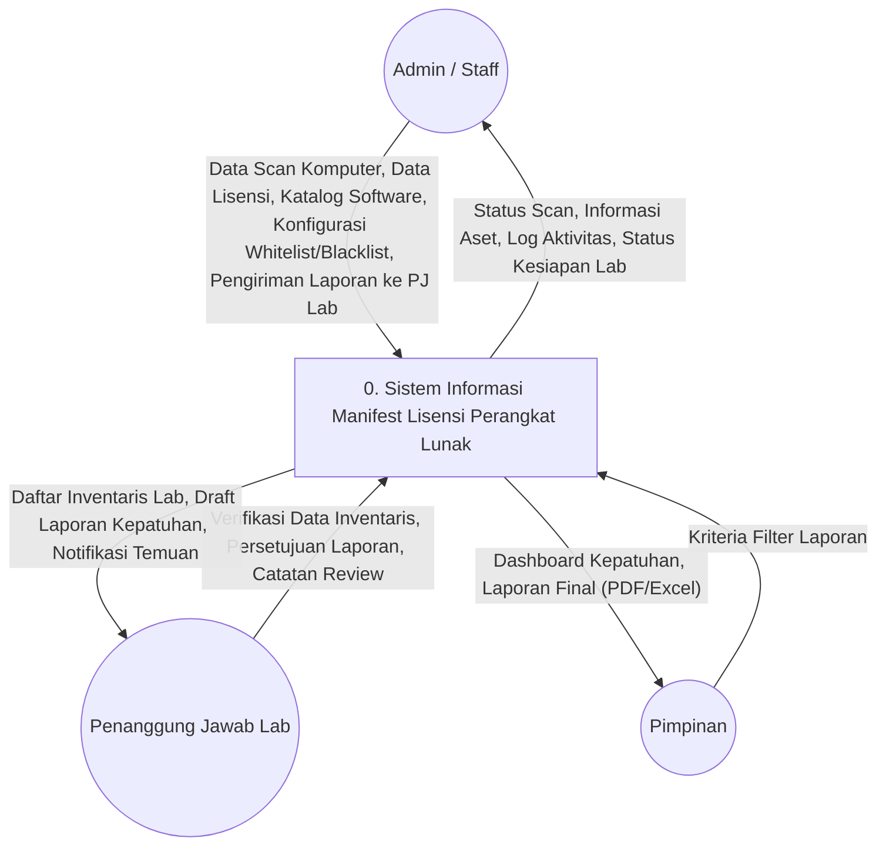
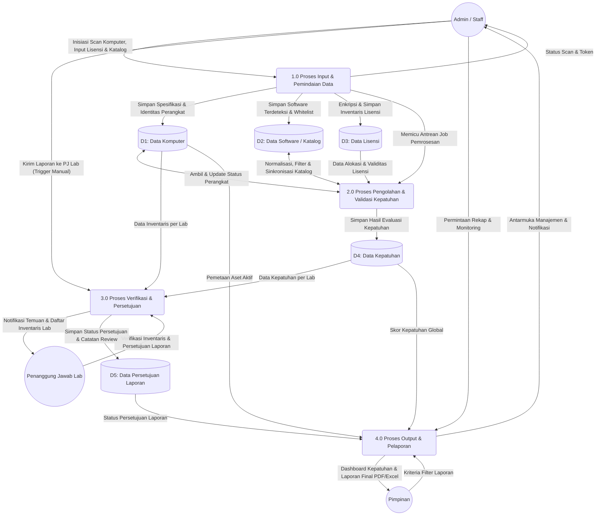
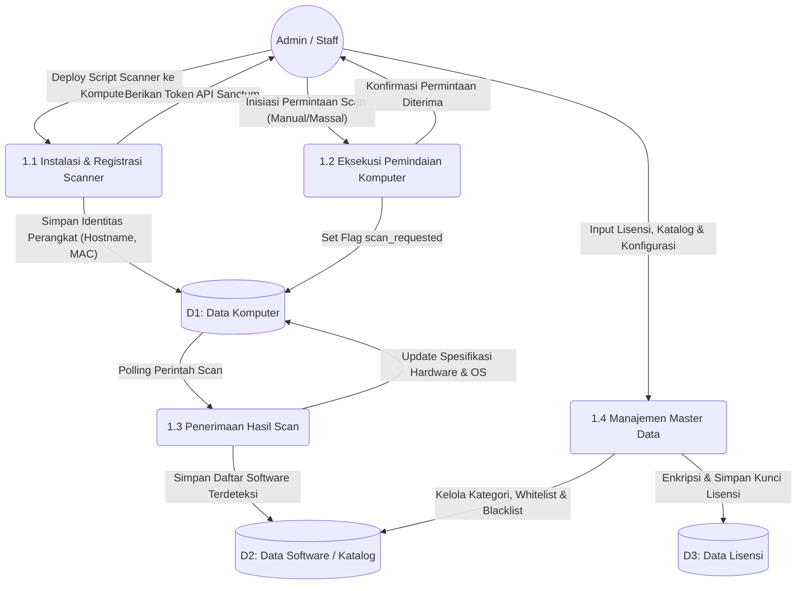
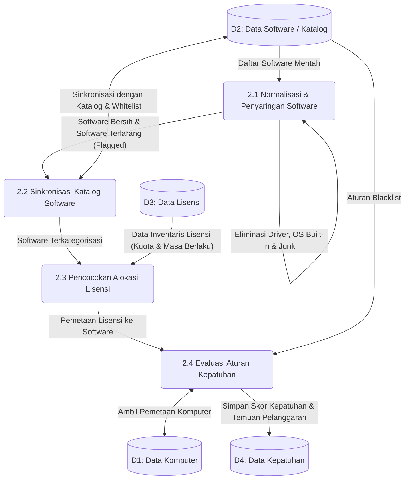
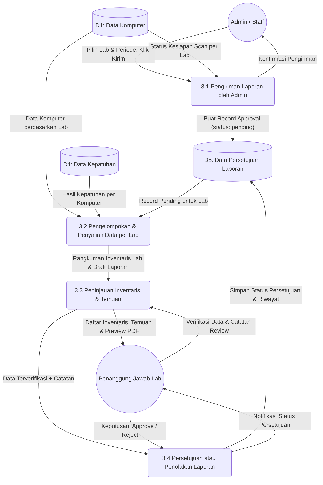
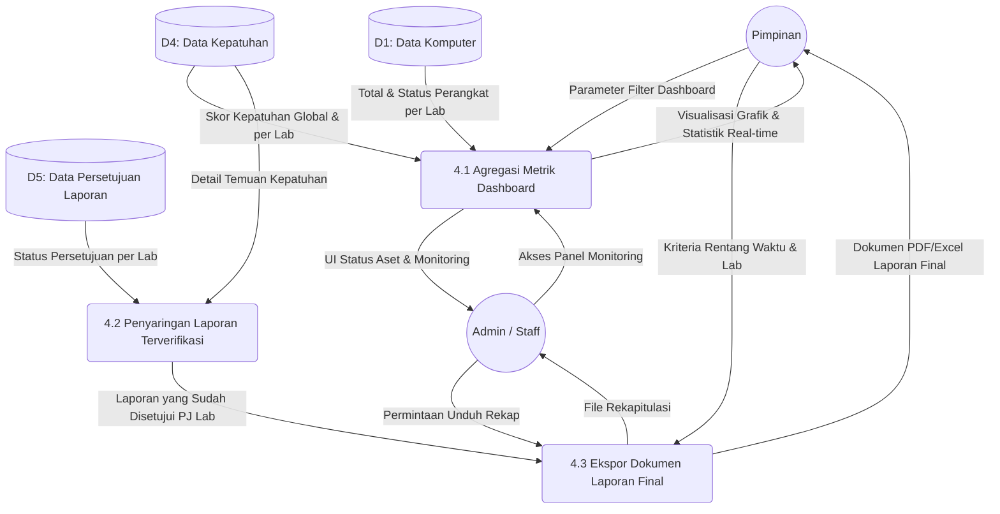

# Perancangan Sistem

### 3.7.1 Diagram Konteks

**Gambar 3.3 Diagram Konteks**

Diagram Konteks (Data Flow Diagram Level 0) di atas (Gambar 3.3) menggambarkan sistem sebagai satu kesatuan proses utama yang berinteraksi dengan lingkungan luarnya, yaitu entitas eksternal. Terdapat tiga entitas eksternal utama yang terlibat dalam Sistem Informasi Manifest Lisensi Perangkat Lunak, yaitu:
1. Administrator (Admin / Staff)
   a. Definisi. Merupakan aktor operasional yang bertugas mengelola keseluruhan master data, mengeksekusi instrumen pemindaian (*scanner*) pada perangkat klien, serta menginisiasi pengiriman draf laporan kepada Penanggung Jawab Lab.
   b. Aliran Data Masuk (ke Sistem). Admin memberikan input berupa eksekusi Data Scan Komputer, Data Lisensi (kunci lisensi terenkripsi), Katalog Software, Konfigurasi Whitelist/Blacklist, serta Pengiriman Laporan ke PJ Lab untuk di-review.
   c. Aliran Data Keluar (dari Sistem). Sistem memberikan output berupa Informasi Aset, Status Scan setiap komputer, Status Kesiapan Lab, dan Log Aktivitas sistem untuk keperluan audit.
2. Penanggung Jawab Lab (PJ Lab)
   a. Definisi. Merupakan aktor manajerial tingkat menengah yang bertugas sebagai penjamin mutu. Entitas ini berwenang memvalidasi integritas data aset dan menyetujui temuan audit kepatuhan secara spesifik pada laboratorium yang menjadi tanggung jawabnya.
   b. Aliran Data Masuk (ke Sistem). PJ Lab memberikan input berupa Verifikasi Data Inventaris, Persetujuan (Approval) Laporan, dan Catatan Review terhadap temuan sistem.
   c. Aliran Data Keluar (dari Sistem). Sistem memberikan output berupa Daftar Inventaris Lab, Draft Laporan Kepatuhan, serta Notifikasi Temuan pelanggaran.
3. Pimpinan
   a. Definisi. Merupakan aktor eksekutif dari pihak universitas (USN Kolaka) yang membutuhkan akses terhadap sistem untuk memantau dan mengambil keputusan strategis (memiliki hak akses *read-only*). Pimpinan hanya menerima data yang telah divalidasi oleh PJ Lab.
   b. Aliran Data Masuk (ke Sistem). Pimpinan memberikan input berupa parameter Kriteria Filter Laporan saat ingin memantau metrik tertentu.
   c. Aliran Data Keluar (dari Sistem). Sistem menyajikan luaran berupa Dashboard Kepatuhan dan Laporan Final (PDF/Excel) yang otentik dan telah disahkan.

### 3.7.2 Data Flow Diagram (DFD)

**a. Data Flow Diagram Level 1**

**Gambar 3.4 Data Flow Diagram Level 1**

Pada DFD Level 1 di Gambar 3.4 di atas, sistem dipecah menjadi empat fase logis utama yang menggambarkan siklus hidup data mulai dari masuk, dievaluasi, diverifikasi, hingga menjadi informasi pelaporan akhir.
1) 1.0 Proses Input & Pemindaian Data
   – Deskripsi. Proses ini menangani pintu masuk data dengan menggunakan instrumen *polling* (scanner) yang dikendalikan oleh Administrator, serta masukan data master secara manual.
   – Aktivitas Utama:
     a. Instalasi dan registrasi *scanner* ke komputer klien.
     b. Inisiasi pemindaian untuk mengekstraksi spesifikasi hardware dan daftar software terinstal.
     c. Menerima masukan dari Administrator terkait pengelolaan master data (katalog, aturan blacklist/whitelist) dan pendaftaran lisensi.
   – Aliran Data. Data perangkat yang masuk disimpan ke dalam data store (D1, D2, D3) dan memicu sistem antrean (Queue) untuk proses validasi.
2) 2.0 Proses Pengolahan & Validasi Kepatuhan
   – Deskripsi. Proses inti (*core engine*) di mana sistem melakukan kalkulasi logika bisnis, normalisasi data, dan pencocokan aturan secara otomatis di latar belakang (*background jobs / Queue*).
   – Aktivitas Utama:
     a. Normalisasi Software. Menyingkirkan komponen bawaan sistem operasi dan mengklasifikasikan nama software berdasarkan Katalog.
     b. Validasi Lisensi. Mencocokkan software komersial yang ditemukan dengan ketersediaan inventaris lisensi.
     c. Deteksi Pelanggaran. Mengevaluasi status kepatuhan berdasarkan ketersediaan lisensi dan aturan aplikasi terlarang (Blacklist).
   – Aliran Data. Menarik data dari D1, D2, dan D3, mengolahnya menjadi status kepatuhan final, lalu menyimpannya ke dalam basis data Kepatuhan (D4).
3) 3.0 Proses Verifikasi & Persetujuan
   – Deskripsi. Proses *check-and-balance* di mana draf hasil pengolahan sistem diajukan oleh Admin kepada PJ Lab untuk dilakukan peninjauan sejawat (*peer review*) sebelum disahkan.
   – Aktivitas Utama:
     a. Admin menginisiasi pengiriman laporan kepatuhan per lab.
     b. PJ Lab memverifikasi kecocokan data inventaris fisik dan perangkat lunak.
     c. PJ Lab memberikan keputusan otorisasi (Approve/Reject) beserta catatan.
   – Aliran Data. Mengambil data dari D1 dan D4, lalu menyimpan rekam jejak keputusan otorisasi secara permanen ke dalam basis data Persetujuan Laporan (D5).
4) 4.0 Proses Output & Pelaporan
   – Deskripsi. Proses penyajian informasi akhir berupa visualisasi *dashboard* dan dokumen cetak dengan memberlakukan filtrasi ketat (hanya data yang telah disetujui PJ Lab yang ditampilkan).
   – Aktivitas Utama:
     a. Menerima parameter atau kriteria filter dari Pimpinan.
     b. Menyaring data kepatuhan yang statusnya telah disetujui (Approved).
     c. Menghasilkan output visual Dashboard interaktif dan dokumen statis (PDF/Excel).
   – Aliran Data: Mengambil hasil analisa final dari D4 yang telah divalidasi keabsahannya berdasarkan D5, lalu mengeluarkannya kepada Pimpinan.

**b. Data Flow Diagram Level 2 Proses 1**

**Gambar 3.5 Data Flow Diagram Level 2 Proses 1**

Dalam Gambar 3.5 di atas, diuraikan tahapan masuknya data ke dalam sistem yang diawali dari persiapan instrumen pemindaian oleh Administrator hingga pengumpulan hasil deteksi perangkat keras dan lunak.
Penjelasan Sub-Proses 1.0:
1) 1.1 Instalasi & Registrasi Scanner. Administrator memasang script pemindai pada komputer klien. Sistem mencatat identitas fisik (Hostname, MAC Address) ke tabel (D1) dan menerbitkan Token Akses untuk saluran komunikasi yang aman.
2) 1.2 Eksekusi Pemindaian Komputer. Administrator memberikan instruksi pemindaian (manual/massal) melalui antarmuka web, yang akan mengubah status flag pada data perangkat (D1).
3) 1.3 Penerimaan Hasil Scan. Instrumen pada komputer klien melakukan *polling* perintah. Saat instruksi diterima, instrumen mengirim paket data (*payload*) spesifikasi sistem dan aplikasi yang terpasang untuk diperbarui ke dalam (D1) dan (D2).
4) 1.4 Manajemen Master Data. Proses penginputan aturan klasifikasi perangkat lunak (D2) serta kunci lisensi terenkripsi (D3) oleh Administrator sebagai parameter penilaian kepatuhan.

**c. Data Flow Diagram Level 2 Proses 2**

Tahap ini mewakili *core engine* (mesin utama) pada arsitektur sistem. Proses ini bersifat internal tanpa intervensi langsung dari entitas luar, bekerja menggunakan metode antrean asinkron berdasarkan ketersediaan data.

**Gambar 3.6 Data Flow Diagram Level 2 Proses 2**

Penjelasan Sub-Proses 2.0:
1) 2.1 Normalisasi & Penyaringan Software. Mengeksekusi modul filter untuk mengeliminasi utilitas bawaan OS atau komponen *driver* dari sekumpulan data mentah (D2) sehingga menyisakan perangkat lunak utama.
2) 2.2 Sinkronisasi Katalog Software. Mencocokkan daftar aplikasi bersih dengan pusat rujukan katalog sistem untuk memisahkan kategori *freeware*, *open-source*, maupun masuknya aplikasi ke dalam status terlarang (*flagged*).
3) 2.3 Pencocokan Alokasi Lisensi. Memetakan instalasi perangkat lunak komersial dengan sisa kuota dan validitas masa berlaku dari inventaris lisensi (D3).
4) 2.4 Evaluasi Aturan Kepatuhan. Fase akhir yang mengkalkulasi bobot insiden kepatuhan, lalu merekam secara definitif status legalitas setiap aplikasi di komputer ke dalam repositori (D4).

**d. Data Flow Diagram Level 2 Proses 3**

Proses ini menggambarkan alur kerja verifikasi administratif, di mana sistem menjembatani temuan mesin dengan analisis berbasis tanggung jawab manusia sebelum data tersebut dilegitimasi menjadi pelaporan resmi institusi.

**Gambar 3.7 Data Flow Diagram Level 2 Proses 3**

Penjelasan Sub-Proses 3.0:
1) 3.1 Pengiriman Laporan oleh Admin. Administrator memantau kesiapan data pemindaian di (D1) dan memicu sistem untuk membentuk draf awal persetujuan (*pending approval*) pada (D5).
2) 3.2 Pengelompokan & Penyajian Data per Lab. Sistem mengelompokkan matriks temuan spesifik (D4) dan inventaris perangkat (D1) secara terisolasi sesuai wilayah otoritas laboratorium terkait.
3) 3.3 Peninjauan Inventaris & Temuan. PJ Lab melakukan evaluasi komprehensif terhadap keakuratan daftar aplikasi dan indikasi pelanggaran yang dihasilkan sistem (*preview* laporan).
4) 3.4 Persetujuan atau Penolakan Laporan. Keputusan final (*Approve/Reject*) dari PJ Lab yang disertai anotasi, kemudian disematkan statusnya secara permanen ke (D5) sebagai log verifikasi (*audit trail*).

**e. Data Flow Diagram Level 2 Proses 4**

Proses penyajian akhir yang mengekstrak kalkulasi sistem menjadi visualisasi antarmuka dan laporan dokumen dengan memberlakukan restriksi (*gatekeeping*) status pengesahan.

**Gambar 3.8 Data Flow Diagram Level 2 Proses 4**

Penjelasan Sub-Proses 4.0:
1) 4.1 Agregasi Metrik Dashboard. Menghasilkan proyeksi grafis (*real-time*) terkait distribusi kepatuhan dan ancaman pelanggaran berdasar himpunan data aktif (D1 dan D4).
2) 4.2 Penyaringan Laporan Terverifikasi. Sistem menerapkan filter krusial (D5) untuk menahan laju informasi agregat (D4) yang belum disahkan (*unapproved*) oleh hierarki PJ Lab.
3) 4.3 Ekspor Dokumen Laporan Final. Ekstraksi dokumen akuntabilitas berupa lembar PDF/Excel yang ditarik khusus untuk ranah yurisdiksi Pimpinan dan Administrator berdasar kriteria seleksi yang diinginkan.