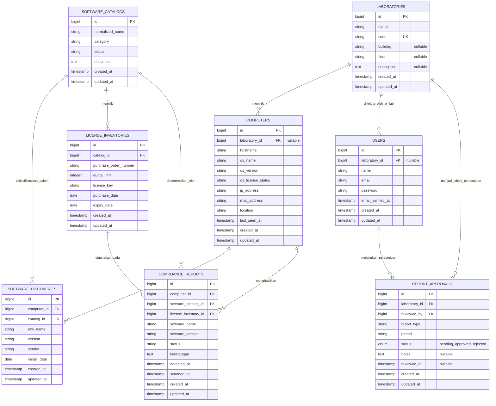

# Perancangan Sistem

### 3.7.3 Entity Relationship Diagram (ERD)

Pemodelan data (*Data Modeling*) pada sistem ini divisualisasikan menggunakan *Entity Relationship Diagram* (ERD). ERD ini menggambarkan entitas-entitas utama yang terlibat dalam ekosistem audit perangkat lunak, beserta atribut dan relasi logis yang mengikatnya. Desain ini dioptimalkan untuk memfasilitasi penemuan perangkat lunak secara otomatis (*automated discovery*), perhitungan kepatuhan (*compliance checking*), serta hierarki persetujuan pelaporan oleh Penanggung Jawab Laboratorium.

1) Entitas Utama dan Atribut (Data Dictionary)
   a) User (Pengguna). Entitas ini merepresentasikan aktor manusia yang berinteraksi dengan sistem manajemen (seperti Administrator IT, Penanggung Jawab Lab, dan unsur Pimpinan USN Kolaka). Menyimpan informasi kredensial yang memfasilitasi proses autentikasi (berbasis Session/Web Guard) dan otorisasi (*Role-Based Access Control*). Memiliki relasi ke laboratorium untuk memetakan tanggung jawab pengelolaan.
   b) Laboratory (Laboratorium). Entitas struktural yang memodelkan laboratorium secara fisik maupun administratif. Entitas ini menjadi pusat pengelompokan aset komputer serta mendelegasikan alur persetujuan laporan kepatuhan kepada Penanggung Jawab Lab.
   c) Computer (Komputer/Agen). Entitas yang mencatat identitas perangkat keras (komputer/laptop) yang beroperasi dalam jaringan institusi. Entitas ini berfungsi sebagai agen autentik (*Authenticatable* menggunakan token Sanctum) yang mengirimkan data manifest perangkat lunak. Atribut utamanya mencakup identitas jaringan (IP dan MAC Address), spesifikasi perangkat keras, dan relasinya terhadap lokasi laboratorium.
   d) SoftwareCatalog (Katalog Perangkat Lunak). Entitas referensi master (*Master Data*) yang berperan sebagai basis pengetahuan (*Knowledge Base*) sistem. Entitas ini menyimpan daftar perangkat lunak yang telah melalui proses normalisasi data. Atribut status dan category digunakan sistem untuk membedakan antara perangkat lunak *freeware*, komersial, berlisensi, maupun perangkat lunak ilegal/bajakan (seperti *crack tool*).
   e) LicenseInventory (Inventaris Lisensi). Entitas yang mendokumentasikan aset tak berwujud berupa kepemilikan lisensi komersial dari pihak USN Kolaka. Memuat data legalitas seperti Nomor *Purchase Order* (PO), masa kedaluwarsa (*expiry date*), alokasi kuota lisensi (*quota limit*), dan *license_key* yang secara teknis disimpan dalam format terenkripsi pada level basis data guna menjaga keamanan informasi.
   f) SoftwareDiscovery (Penemuan Perangkat Lunak). Entitas transaksional yang mengakomodasi data mentah (*raw data*) hasil pemindaian skrip agen dari setiap komputer. Data ini berisi nama perangkat lunak (*raw_name*), versi, dan vendor, yang selanjutnya dipetakan ke dalam entitas SoftwareCatalog untuk standarisasi analisis.
   g) ComplianceReport (Laporan Kepatuhan). Entitas analitik yang bertindak sebagai *output* akhir dari sistem cerdas ini. Menyimpan rekam jejak evaluasi legalitas untuk setiap instalasi perangkat lunak pada perangkat komputer tertentu. Entitas ini menentukan secara definitif apakah perangkat lunak berstatus "Kepatuhan Terpenuhi" (*Compliant*), "Tidak Berlisensi", atau "Ilegal", berdasarkan persilangan data antara temuan instalasi, katalog, dan ketersediaan alokasi lisensi pada LicenseInventory.
   h) ReportApproval (Persetujuan Laporan). Entitas transaksional yang mencatat riwayat verifikasi administratif. Menyimpan data persetujuan (*approve*) atau penolakan (*reject*) beserta catatan (*notes*) dari Penanggung Jawab (PJ) Lab terhadap laporan kepatuhan pada laboratorium dan periode tertentu, sebelum laporan tersebut disahkan untuk pihak pimpinan.

2) Aturan Bisnis dan Relasi
   a) Relasi Laboratory ke Computer (1 : M / One-to-Many). Satu ruang laboratorium (1) menaungi banyak (M) komputer klien secara fisik dan administratif. Namun, satu unit komputer hanya dialokasikan secara spesifik pada satu laboratorium.
   b) Relasi Laboratory ke User (1 : M / One-to-Many). Satu laboratorium (1) dapat dikelola oleh satu atau lebih (M) pengguna yang bertugas sebagai Penanggung Jawab (PJ) Lab.
   c) Relasi Laboratory ke ReportApproval (1 : M / One-to-Many). Satu laboratorium (1) menjadi entitas objek yang direview dan menghasilkan banyak (M) catatan persetujuan laporan di berbagai periode pelaporan.
   d) Relasi User ke ReportApproval (1 : M / One-to-Many). Satu pengguna atau PJ Lab (1) dapat melakukan *review* dan menerbitkan banyak (M) riwayat persetujuan atau penolakan laporan.
   e) Relasi Computer ke SoftwareDiscovery (1 : M / One-to-Many). Satu unit komputer/laptop (1) dipastikan memiliki atau terinstal banyak (M) perangkat lunak hasil pemindaian agen. Namun, satu rekaman instalasi perangkat lunak secara spesifik melekat secara eksklusif hanya pada satu perangkat komputer.
   f) Relasi SoftwareCatalog ke SoftwareDiscovery (1 : M / One-to-Many). Satu rujukan standar aplikasi pada katalog utama (1) dapat merepresentasikan banyak (M) instalasi dari aplikasi tersebut yang tersebar di berbagai komputer dalam lingkungan kampus.
   g) Relasi SoftwareCatalog ke LicenseInventory (1 : M / One-to-Many). Satu jenis perangkat lunak komersial (1) yang ada pada katalog dapat memiliki beberapa/banyak (M) dokumen inventaris lisensi. Hal ini mengakomodasi skenario bisnis di mana institusi melakukan pembelian lisensi secara bertahap atau *renewal* pada tahun anggaran yang berbeda.
   h) Relasi Computer ke ComplianceReport (1 : M / One-to-Many). Berdasarkan proses evaluasi komputasi awan/server, satu perangkat komputer (1) akan menghasilkan banyak (M) baris laporan kepatuhan yang menjabarkan status legalitas masing-masing program/aplikasi di komputer tersebut.
   i) Relasi LicenseInventory ke ComplianceReport (1 : M / One-to-Many). Satu aset lisensi (1) dapat digunakan (atau dialokasikan) ke dalam banyak (M) laporan kepatuhan pada berbagai komputer, asalkan total alokasinya tidak melampaui batas kuota volume yang telah ditetapkan.
   j) Relasi SoftwareCatalog ke ComplianceReport (1 : M / One-to-Many). Satu perangkat lunak pada katalog utama (1) dapat direferensikan oleh banyak (M) laporan kepatuhan yang merangkum audit legalitas perangkat lunak tersebut di seluruh infrastruktur sistem informasi USN Kolaka.

**Gambar 3.9 Entity Relationship Diagram (ERD)**